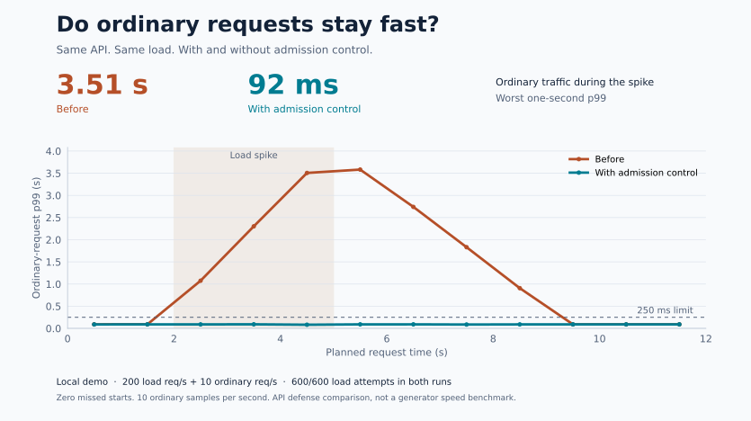
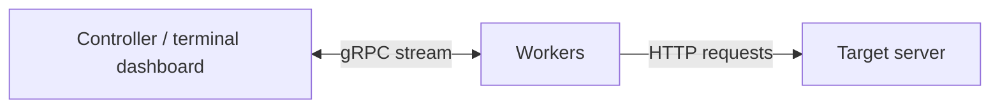

# Using SwarmGo

[Back to the overview](README.md) · [日本語](GUIDE_ja.md)

## Try it locally

Install Docker with Docker Compose, then run:

```bash
git clone https://github.com/ryokotaka/SwarmGo.git
cd SwarmGo
docker compose up -d --build
docker attach "$(docker compose ps -q master)"
```

Wait for `Workers: 3`, then press **s**. Each worker sends 3,000 GET requests to the included `target-server`, with up to 10 requests in flight. That is **9,000 requests and up to 30 concurrent requests** across the three workers.

The dashboard keeps the result after the run finishes. Press **s** to run again, or **q** to cancel active requests and quit the controller. To detach without quitting, press **Ctrl+P**, then **Ctrl+Q**.

Clean up the containers when finished:

```bash
docker compose down
```

Only test systems you own or have permission to test. This example sends traffic inside the local Compose network.

## Check ordinary traffic during overload

Can people still use your API when traffic spikes? `swarmgo resilience` keeps ordinary requests running alongside a timed load spike and checks their latency, failures and recovery.

In the local example, adding admission control to the API reduced ordinary-request latency during the spike from **3.51 s to 92 ms** (worst one-second p99). Both runs sent the full load schedule. This is the API's before/after result, measured with SwarmGo.

<picture>
  <source media="(prefers-color-scheme: dark)" srcset="assets/resilience-dark.svg">
  <source media="(prefers-color-scheme: light)" srcset="assets/resilience.svg">
  
</picture>

Try the local before/after example from the repository root:

```sh
python3 examples/resilience/demo.py
```

Requires Go, Python 3 and a local Docker engine. The example uses an internal network, writes JSON reports, then removes its containers. Missed requests make the result inconclusive. [Recorded results, commands and measurement details](examples/resilience/)

## Change the load

Requests and concurrency are **per worker**. This example runs 5 workers with 1,000 requests each, for 5,000 requests in total:

```bash
TOTAL_REQUESTS=1000 CONCURRENCY=5 docker compose up -d --build --scale worker=5
docker attach "$(docker compose ps -q master)"
```

| Setting | Compose default | Meaning |
| --- | --- | --- |
| `TARGET_URL` | `http://target-server` | URL each worker sends requests to |
| `TOTAL_REQUESTS` | `3000` | Requests per worker per run |
| `CONCURRENCY` | `10` | Maximum in-flight requests per worker |
| `--scale worker=N` | `3` | Number of worker containers |

To see HTTP failures in the dashboard, the included echo server can return errors:

```bash
TARGET_URL='http://target-server/?echo_code=500' TOTAL_REQUESTS=100 docker compose up -d --build
docker attach "$(docker compose ps -q master)"
```

Press **s** and wait for the run to finish. The dashboard should show failed requests grouped under `HTTP 500 Internal Server Error`.

## Run from source

Use **Go 1.25.7 or later**, as specified in [go.mod](./go.mod).

```bash
go build -o swarmgo ./cmd/swarmgo
```

Start a local HTTP server or use an application already running on your machine. For example, with Python 3, serve an empty temporary directory in one terminal:

```bash
python3 -m http.server 8080 --bind 127.0.0.1 --directory "$(mktemp -d)"
```

In another terminal, start the controller:

```bash
./swarmgo master -url http://127.0.0.1:8080 -n 100 -c 5
```

Then start a worker in a third terminal:

```bash
./swarmgo worker
```

Press **s** in the controller. You can start more workers in additional terminals before a run.

The source-build defaults are `http://127.0.0.1:8080`, 5 requests, and concurrency 1. Set the same environment variables as above, or override them with `-url`, `-n`, and `-c`. A worker connects to `localhost:50051` by default; use `-addr host:port` or `MASTER_ADDR` to change it. The controller's port is set with `-p`.

`master -no-tui` starts only the gRPC listener. It does not automatically start a load test or provide a command-line trigger.

## Run once and save the result

With a local target running, start a controller that waits for two workers:

```bash
./swarmgo run -url http://127.0.0.1:8080 -workers 2 -n 100 -c 5 -output report.json
```

Run `./swarmgo worker` in two other terminals. The test starts automatically when both workers connect, sends 200 requests in total, writes `report.json`, and shuts down the workers. No keypress is needed.

`-worker-timeout` sets the wait for workers (default `30s`); `-timeout` limits the run (default `2m`). The command exits with status 0 only when all planned requests finish successfully. Failed requests, disconnections, timeouts, and output errors return status 1; invalid arguments return status 2.

The JSON includes completion status, request counts, elapsed time, a controller-wide request rate, and each worker's latency percentiles and errors. The controller rate uses dispatch through the last report as its time window. Latency percentiles remain per worker. The request flags below work with both `master` and `run`.

Use `workers[].latency_us` for P50/P90/P99 in microseconds. The older `latency_ms` field remains as truncated integer milliseconds for compatibility. Both are `null` without a completed worker report or successful samples; `latency_us` is also `null` for older workers that report only whole milliseconds.

## Send JSON

For a local API that accepts JSON at `/api`, create a body file and start the controller with POST:

```bash
printf '%s\n' '{"message":"hello"}' > request.json
./swarmgo master -url http://127.0.0.1:8080/api -method POST \
  -body-file request.json -header 'Content-Type: application/json' -n 100 -c 5
```

Start workers as above, then press **s**. Use an endpoint that handles POST; Python's file server from the GET example does not.

`-body-file` is read once at startup (maximum 1 MiB), and every request gets the same bytes. Content length is set automatically. Set `Content-Type` explicitly for your payload. Repeat `-header 'Name: value'` for more headers; the last value for a name wins, ignoring case.

Use the same build for the controller and workers. Older workers ignore the new method/body/header fields and send GET requests. Updated workers still accept GET commands from older controllers.

## How it works

I built this project to understand Go concurrency and gRPC streaming by making the coordination visible: one controller, several request-sending workers, and a live view of the run.



The controller sends a start command to the workers connected at the beginning of a run. Each worker uses a fixed-size goroutine pool, sends HTTP requests directly to the target, and reports progress through the same gRPC stream. Workers that connect later join the next run.

The worker keeps listening for commands during a run. Quit, Stop, and a lost controller connection cancel in-flight HTTP requests. The dashboard ignores a second start while a run is active.

Useful entry points in the code:

- [runner.go](./internal/worker/runner.go): request validation and standard HTTP execution.
- [direct.go](./internal/worker/direct.go): prebuilt HTTP/1.1 requests, connection reuse, verified TLS and cancellation.
- [direct_head.go](./internal/worker/direct_head.go): in-place parsing of common response headers, with fallback to fasthttp.
- [aggregate.go](./internal/worker/aggregate.go): concurrent execution, counters and bounded latency histograms.
- [client.go](./internal/worker/client.go): worker commands and ordered progress reports.
- [server.go](./internal/master/server.go): connected workers and run state.
- [tui.go](./cmd/swarmgo/tui.go): dashboard and keyboard input.
- [run.go](./cmd/swarmgo/run.go): automatic runs and JSON reports.
- [swarm.proto](./proto/swarm.proto): the messages exchanged between controller and workers.

Most HTTP/1.1 requests reuse prebuilt request bytes and a connection owned by one execution lane. HEAD, CONNECT, upgrades, `Expect` requests and custom client policies use the standard Go client. Redirects follow Go’s method and credential rules; a redirected lane then keeps using the standard client.

Response headers in the common form (HTTP/1.1, a final non-redirect status, framing by one `Content-Length` or `Transfer-Encoding: chunked`) are read in place without copying or allocating. Only status, framing, `Content-Encoding` and `Connection` are interpreted, but every field is checked for valid bytes. Anything else — HTTP/1.0, informational responses, redirects, folded lines, duplicate or conflicting framing, `Trailer`, or a header split across reads — goes to fasthttp's full parser on the same unconsumed bytes.

## Measurement details

These definitions apply to `master` and `run`. For scheduled spikes and the ordinary-traffic probe, see the [`resilience` metrics](examples/resilience/).

<details>
<summary>How requests, RPS, latency, and errors are counted</summary>

- **Success / failure:** a request succeeds if its response body is read completely and its final HTTP status is below 400. HTTP 4xx/5xx, connection errors, timeouts, and canceled in-flight requests count as failures. Each request has a 30-second timeout covering connection, request and complete response. A watchdog enforces it instead of per-request socket deadlines, so a late request fails within 1% of the timeout after it (at most 50 ms). Redirects follow Go's default HTTP client behavior.
- **RPS:** completed requests divided by elapsed wall time for each worker, summed on the dashboard. These are running averages, not instantaneous samples or one precisely synchronized cluster-wide rate. The final values stay on screen after completion.
- **Latency:** time to receive the full response, for successful requests only. Workers calculate P50/P90/P99 from HDR histograms when they finish (microsecond units, three significant digits: up to 0.1% value quantization plus less than 1 microsecond from conversion). The dashboard shows the three values from the reporting worker with the highest P99; these are **not pooled percentiles across all workers**. Values retain microsecond precision and display as milliseconds with three decimal places. Until a final report arrives, the dashboard says when latency will be available. For older workers, a truncated zero displays as `<1 ms`.
- **Errors:** grouped reasons arrive with each worker's final report. A disconnected worker may leave partial results; its missing work is not reassigned.

Connections and small result batches are bounded by concurrency. Latency histogram storage is fixed per CPU shard and does not grow with the request count.

</details>

## Scope

`master` and `run` use fixed request counts and concurrency. `resilience` schedules a load spike at a requested rate alongside ordinary traffic. Worker reconnection and TLS/authentication on the control connection are not implemented. Keep the controller and workers on a trusted network. Compose exposes the controller port only on localhost; the source-built controller listens on all interfaces.

## Development

[MIT license](./LICENSE) · [Original Compose walkthrough](./demo-docker.gif)

```bash
go test -race ./...
go vet ./...
go build ./...
```

The tests use local HTTP and gRPC servers. They cover concurrent GET/POST requests, body replay, cancellation, result ordering, elapsed-time calculations, and recovery when dashboard notifications are dropped. The same checks run in GitHub Actions.

The header fast path has a differential test and a fuzz target: every header it accepts must be read identically by fasthttp, including the number of bytes consumed. A micro-benchmark measures the per-request cost of the HTTP/1.1 path with the network replaced by a canned response:

```bash
go test ./internal/worker -run '^$' -fuzz FuzzParseHead -fuzztime 60s
go test ./internal/worker -run '^$' -bench DirectRequest -benchmem
```

`cmd/swarmgo/default.pgo` is a CPU profile of the worker's request path. `go build` and `go install` use it automatically for profile-guided optimization. [How it was recorded and how to refresh it](benchmarks/header-parsing/#follow-up-profile-guided-optimization).

Generated protocol files are checked in, so building does not require `protoc`. To change the schema, regenerate with protoc 33.4, protoc-gen-go v1.36.11, and protoc-gen-go-grpc v1.6.1:

```bash
protoc --go_out=. --go_opt=paths=source_relative \
  --go-grpc_out=. --go-grpc_opt=paths=source_relative proto/swarm.proto
```
