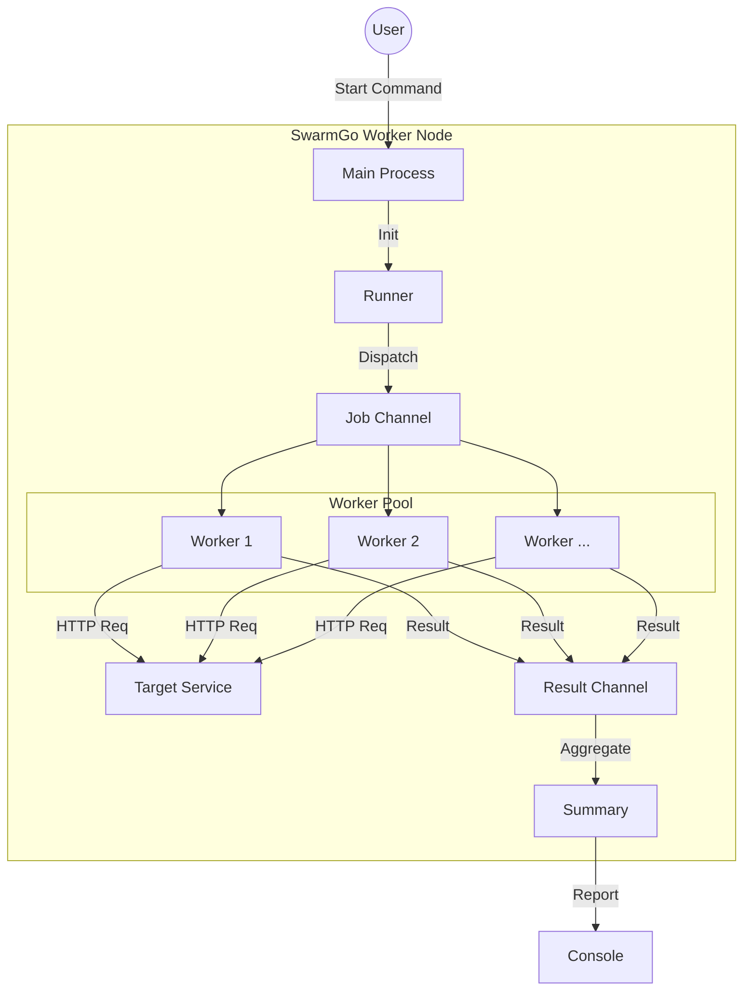

<div align="center">

# SwarmGo 

[](https://go.dev/)
[](./LICENSE)
[](./README_ja.md)
<br>
<br>
<p>
A lightweight HTTP load testing tool written in Go.<br>
It uses the <strong>Worker Pool pattern</strong> to handle high concurrency with stable memory usage.
</p>
<br>


</div>

## 🚀 Features


<table>
  <tbody>
    <tr>
      <td><strong><span style="color:#ff4d4f;"> Results at a glance</span></strong></td>
      <td>Mean latency, RPS, success/failure counts, and a per-status-code breakdown (200, 500, etc.) so you can see how the server behaved.</td>
    </tr>
    <tr>
      <td><strong><span style="color:#ff4d4f;"> Up and running with one command</span></strong></td>
      <td>No config files—just URL, count, and concurrency. Start a test in seconds.</td>
    </tr>
    <tr>
      <td><strong><span style="color:#ff4d4f;"> Low memory footprint, high load on the target</span></strong></td>
      <td>Uses a Worker Pool to keep memory usage stable while pushing high concurrency to the target.</td>
    </tr>
    <tr>
      <td><strong><span style="color:#ff4d4f;"> Interrupt safely—results stay accurate</span></strong></td>
      <td>On <code>Ctrl+C</code>, in-flight requests finish before exit, so your numbers stay trustworthy.</td>
    </tr>
  </tbody>
</table>


## 🛠 Architecture

This tool uses a buffered channel for job dispatching and a fixed-size worker pool for execution.



## 💡 Why Worker Pool? (Solving OOM)

My initial approach was to spawn a new goroutine for every single request. While this worked for small loads, it caused Out of Memory (OOM) crashes when testing with large numbers (e.g., 1 million requests) because of the sheer number of goroutines.

To fix this, I implemented the **Worker Pool pattern**. Instead of creating `N` goroutines, the tool now creates a fixed number of workers (defined by `-c`). These workers pull tasks from a queue, keeping memory usage low and stable regardless of the total request count.

## 📦 Installation

Requires Go 1.22+.

```bash
git clone https://github.com/ryokotaka/SwarmGo.git
cd SwarmGo
go mod tidy
```

## 📖 Usage

Build and run via CLI.

```bash
# Build
go build -o swarmgo cmd/worker/main.go

# Example: Run 100 requests with 10 concurrency
./swarmgo -url https://example.com -n 100 -c 10
```

### Options

| Flag | Description | Required | Default |
|------|-------------|:--------:|---------|
| `-url` | Target URL | ✓ | - |
| `-n` | Total requests | ✓ | 0 |
| `-c` | Concurrency (Worker count) | ✓ | 0 |

## 📊 Output Example

```
Summary:
  Total Requests: 10
  Success:        10
  Failed:         0
  Total Duration: 116.75ms
--------------------------------------------------
  RPS:            85.65 req/s
  Mean Latency:   23.26ms
--------------------------------------------------
Status codes:
  200: 10
```

## 🗺 Roadmap

- [ ] Real-time progress bar
- [ ] Support POST methods
- [ ] RPS measurement
- [ ] Latency distribution (P50, P99)

## 📜 License

MIT
