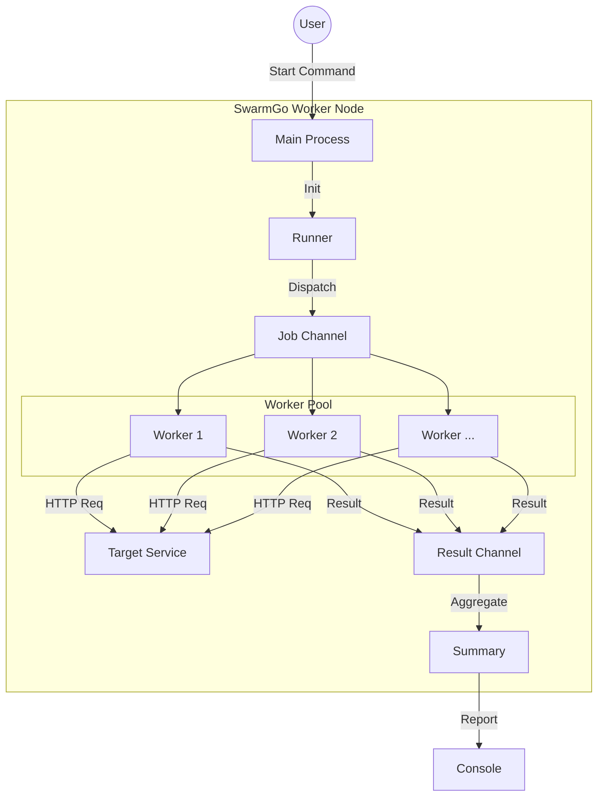

[<div align="center">

# SwarmGo 

[](https://go.dev/)
[](./LICENSE)
[](./README_ja.md)

<p>
A lightweight, high-performance load testing tool written in Go.<br>
Designed with concurrency patterns (Worker Pool) and graceful shutdown capabilities.
</p>


</div>

## 🚀 Features

- **Concurrent Execution**: Uses Go routines and channels (Worker Pool pattern) for efficient load generation.
- **Graceful Shutdown**: Handles signals (SIGINT/SIGTERM) to safely stop ongoing requests.
- **Real-time Metrics**: Calculates RPS (Requests Per Second) and Mean Latency.
- **Resource Efficient**: Reuse TCP connections with a custom HTTP Transport configuration.

## 🛠 Architecture



## 📦 Installation

```bash
git clone https://github.com/ryokotaka/SwarmGo.git
cd SwarmGo
go mod tidy
```

## 📖 Usage

**Syntax:**

```bash
worker -url <Target_URL> -n <Total_Requests> -c <Concurrency>
```

**Example:** Send 100 requests to example.com with 10 concurrent workers

```bash
worker -url https://example.com -n 100 -c 10
```

## 📊 Output Example

```
Summary:
  Total Requests: 10
  Success:        10
  Failed:         0
  Total Duration: 116.75ms
--------------------------------------------------
  RPS:            85.65 req/s
  Mean Latency:   23.26ms
--------------------------------------------------
Status codes:
  200: 10
```

## 📜 License

MIT
