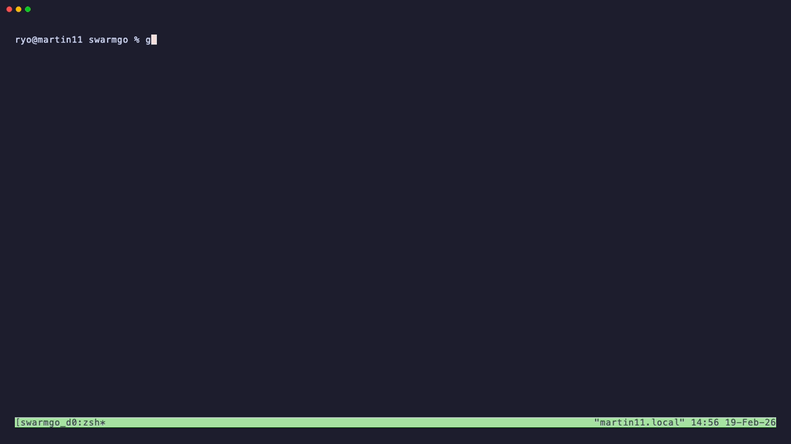
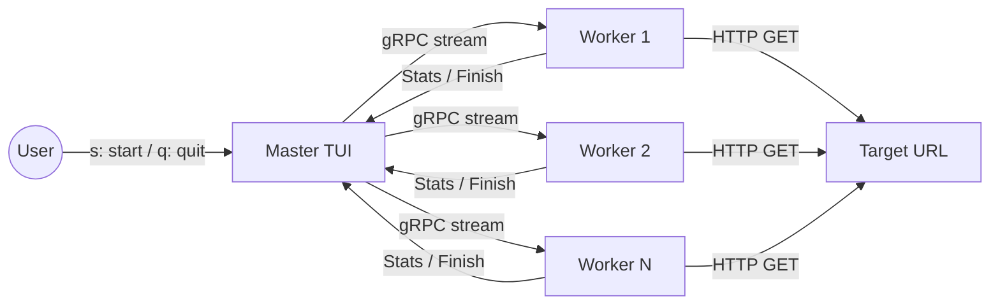

<div align="center">

# SwarmGo 

[](https://go.dev/)
[](./LICENSE)
[](./README_ja.md)
<br>
<br>
<p>
A distributed HTTP load testing tool written in Go.<br>
<strong>Master</strong> (TUI or headless) coordinates <strong>Workers</strong> over gRPC; each Worker uses a <strong>Worker Pool</strong> for stable memory under high concurrency.
</p>
<br>





</div>

## 🚀 Features


<table>
  <tbody>
    <tr>
      <td><strong><span style="color:#ff4d4f;"> Master + Workers over gRPC</span></strong></td>
      <td>One Master (TUI or headless) commands multiple Workers; scale by adding more Worker processes or machines.</td>
    </tr>
    <tr>
      <td><strong><span style="color:#ff4d4f;"> TUI dashboard</span></strong></td>
      <td>See connected Workers, live RPS, success/fail counts, and logs. Press <code>s</code> to start a test, <code>q</code> to quit and signal Workers.</td>
    </tr>
    <tr>
      <td><strong><span style="color:#ff4d4f;"> Low memory per Worker</span></strong></td>
      <td>Each Worker uses a fixed-size Worker Pool so memory stays stable under high concurrency.</td>
    </tr>
    <tr>
      <td><strong><span style="color:#ff4d4f;"> Headless Master</span></strong></td>
      <td>Use <code>-no-tui</code> for gRPC-only Master (CI, SSH, or scripted runs).</td>
    </tr>
  </tbody>
</table>


## 🛠 Architecture

- **Master**: gRPC server with an optional TUI dashboard. Sends Start/Stop/Quit to Workers and shows connection count, RPS, and logs.
- **Worker**: Connects to Master, receives commands, and runs HTTP load tests using a fixed-size worker pool (buffered job channel) for stable memory.


```mermaid
graph LR
    User((User)) -->|s: start / q: quit| Master[Master TUI]
    Master -->|gRPC stream| W1[Worker 1]
    Master -->|gRPC stream| W2[Worker 2]
    Master -->|gRPC stream| WN[Worker N]
    W1 & W2 & WN -->|HTTP GET| Target[Target URL]
    W1 & W2 & WN -->|Stats / Finish| Master
```

## 💡 Why Worker Pool? (Solving OOM)

My initial approach was to spawn a new goroutine for every single request. While this worked for small loads, it caused Out of Memory (OOM) crashes when testing with large numbers (e.g., 1 million requests) because of the sheer number of goroutines.

To fix this, I implemented the **Worker Pool pattern**. Instead of creating `N` goroutines, the tool now creates a fixed number of workers (defined by `-c`). These workers pull tasks from a queue, keeping memory usage low and stable regardless of the total request count.

## 📦 Installation

Requires Go 1.22+.

```bash
git clone https://github.com/ryokotaka/SwarmGo.git
cd SwarmGo
go mod tidy
go build -o swarmgo ./cmd/swarmgo/
```

## 📖 Usage

### Master (commander)

Start the Master; it runs a gRPC server and an optional TUI dashboard.

```bash
# With TUI (default): dashboard, press 's' to start a test, 'q' to quit
./swarmgo master -p 50051

# Headless (no TUI): gRPC only, e.g. for CI or remote servers
./swarmgo master -p 50051 -no-tui
```

| Flag     | Description              | Default  |
|----------|--------------------------|----------|
| `-p`     | gRPC listen port         | `50051`  |
| `-no-tui`| Run without TUI (headless)| false    |

### Worker (load generator)

Workers connect to the Master and run load tests when the Master sends a Start command.

```bash
# Same machine (default Master address: localhost:50051)
./swarmgo worker

# Custom Master address
./swarmgo worker -addr 192.168.1.10:50051

# Or use environment variable
MASTER_ADDR=master.example.com:50051 ./swarmgo worker
```

| Option         | Description                    | Default          |
|----------------|--------------------------------|------------------|
| `-addr`        | Master address (host:port)     | (see below)      |
| `MASTER_ADDR`  | Master address (env)            | `localhost:50051`|

### Quick run

1. Terminal 1: `./swarmgo master -p 50051`
2. Terminal 2: `./swarmgo worker` (add more terminals for more workers)
3. In the Master TUI, press **s** to start a test (target/requests/concurrency are set in the TUI for now).

### Run with Docker

Go をインストールしていなくても、Docker だけで Master（TUI 付き）と Worker を動かせます。

**1. バックグラウンドで起動（推奨）**  
ログでターミナルが埋まらず、スクロールも自由にできます。

```bash
docker compose up -d --build
```

- **master**: TUI 付きで起動。ポート 50051 を公開。
- **worker**: 3 台起動（`--scale worker=5` で台数変更可能）。

**2. 止めるとき**

```bash
docker compose down
```

**3. Master の TUI を操作する（s で開始・q で終了）**

```bash
# Master コンテナにアタッチ（TUI が表示される）
docker attach $(docker compose ps -q master)
# 終了: Ctrl+P → Ctrl+Q でデタッチ（コンテナは動いたまま）。q を押すと Master が終了。
```

**フォアグラウンドで起動する場合**（ログが流れ続け、Ctrl+C で止まる）:

```bash
docker compose up --build
```

**単体で動かす例:**

```bash
docker build -t swarmgo .

# Master（TUI 付き。 -it でインタラクティブに）
docker run -it --rm -p 50051:50051 swarmgo master -p 50051

# Worker（別ターミナル。--link やネットワークで master に接続）
docker run --rm swarmgo worker -addr host.docker.internal:50051
```

## 📊 Output

- **Master TUI**: Workers count, total RPS graph, success/fail counters, and a log of connect/disconnect/finish events.
- **Worker** (when run with TUI Master): Receives Start, runs HTTP load test, reports Stats and Finish to Master.

Standalone worker-style output (RPS, mean latency, status codes) appears in each Worker’s log when a test finishes.

## 🗺 Roadmap

- [ ] Configurable target URL / requests / concurrency from TUI
- [ ] Real-time progress in TUI
- [ ] Support POST and other methods
- [ ] Latency distribution (P50, P99)

## 📜 License

MIT
