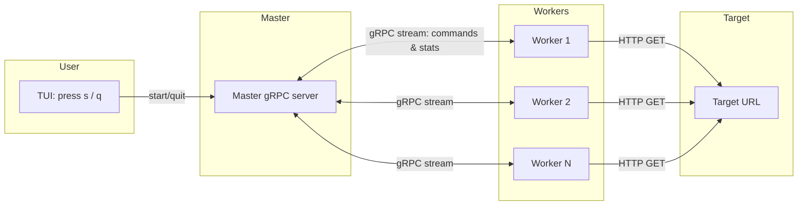

<div align="center">

# **SwarmGo**

[](https://go.dev/)
[](https://grpc.io/)
[](https://www.docker.com/)
[](./LICENSE)
[](./README_ja.md)

<br>

**A small Go/gRPC load-testing demo with a live terminal dashboard.**

SwarmGo runs one controller, multiple request-sending Workers, and a local target server with Docker Compose. The demo needs no cloud server, external API, or Go install: start it, press **`s`**, and watch worker coordination, RPS, latency, success/failure counts, and grouped errors update in real time.

<br>

---

</div>

## Demo

The Docker Compose demo starts one controller, three request-sending workers, and a local `target-server`.

<div align="center">


</div>

The terminal dashboard shows connected workers, progress, RPS, P50/P90/P99 latency, success/failure counts, and common error reasons while the test runs. The default demo stays inside Docker Compose, so you can try the project without sending traffic to a real external service.

---

## Why it's worth a look

SwarmGo is not trying to replace mature tools like k6, wrk, or Vegeta. It is a compact project that makes the moving parts of distributed load generation easy to run and inspect:

- one Master broadcasts commands to many Workers over long-lived gRPC streams
- Workers generate HTTP traffic concurrently and stream stats back to the Master
- the TUI makes normally hidden behavior visible: RPS, latency percentiles, progress, success/failure counts, and grouped errors
- the built-in `target-server` makes success, higher-load, and mixed-failure demos safe to run locally
- the codebase is small enough to read after the demo

Best for trying load-testing basics and then reading a small Go/gRPC distributed-systems project — not a production benchmark suite.

---

## Quickstart: local only

Requires Docker and Docker Compose. You do not need to install Go for this demo.

```bash
git clone https://github.com/ryokotaka/SwarmGo.git
cd SwarmGo
docker compose up -d --build
docker attach $(docker compose ps -q master)
```

When the terminal dashboard opens, press **`s`** to send test traffic to the built-in `target-server`.

**What you should see** once the workers connect and the run starts:

- `Workers: 3` by default.
- `Total RPS (realtime)` changing from `(no data yet)` to an ASCII graph and a requests-per-second value.
- `Success`, `Fail`, `Progress: current / total (%)`, and latency values updating during the run.
- `Errors: None` for the healthy local target, or grouped error reasons when requests fail.

**To stop:** press **`q`** to quit the controller and stop the run; detach without stopping it with `Ctrl+P` then `Ctrl+Q`; clean up with `docker compose down`.

> Safety: only run load tests against systems you own or have explicit permission to test. The default quickstart targets the local `target-server` container.

---

## Local-only checks

<details>
<summary>Show a 100,000-request local run and a mixed-failure demo</summary>

SwarmGo can be pushed harder without a cloud server or public traffic — these runs stay inside the local Docker Compose network.

### 100,000-request run

```bash
TOTAL_REQUESTS=10000 CONCURRENCY=20 docker compose up -d --build --scale worker=10
docker attach $(docker compose ps -q master)
```

Press **`s`** in the TUI to start. Example result from one local run:

| Item | Value |
|------|-------|
| Target | `http://target-server` inside Docker Compose |
| Workers | 10 |
| Requests | 100,000 total (`10,000` per Worker) |
| Concurrency | 200 total (`20` per Worker) |
| Result | 100,000 success, 0 fail (`Errors: None`) |
| Realtime RPS | roughly 6.3k-7.1k RPS while most workers were active |

This is a local sanity/stress test, not a claim about public-internet performance; results depend on the machine, Docker runtime, and target. Keep the target as `http://target-server` unless you own the system and have permission to test it.

### Mixed-failure example

The local `target-server` can return a mix of `200`, `404`, and `500`, so the TUI's grouped failures are visible without testing a real service:

```bash
TARGET_URL='http://target-server/?echo_code=200-200-404-500' TOTAL_REQUESTS=300 CONCURRENCY=10 docker compose up -d --build --scale worker=3
docker attach $(docker compose ps -q master)
```

Press **`s`** to start. HTTP `404` and `500` responses are counted as failures and grouped by reason:

```text
Success: 468   Fail: 432
Errors:
  - HTTP 500 500 Internal Server Error: 226
  - HTTP 404 404 Not Found: 206
```

Counts vary because the echo server randomizes among the configured codes; the run stays inside Docker Compose. Clean up with `docker compose down`.

</details>

---

## Features

| Feature | Description |
|--------|-------------|
| **Distributed Master/Worker model** | One Master coordinates many Workers over long-lived gRPC streams. |
| **Stable concurrency model** | Each Worker uses a fixed-size worker pool instead of spawning one goroutine per request. |
| **Latency percentiles** | Workers report P50/P90/P99 latency for successful requests. |
| **Top error reasons** | Network errors and HTTP 4xx/5xx responses are counted as failures and grouped for the TUI. |
| **Headless Master** | Use `-no-tui` when you only need the gRPC Master for scripts, CI, or remote runs. |

---

## Docker options

**Scale Workers** (3 by default):

```bash
docker compose up -d --build --scale worker=5
```

**Change target, requests, or concurrency.** By default Docker Compose points SwarmGo at the included `target-server` (`TARGET_URL=http://target-server`, `TOTAL_REQUESTS=3000`, `CONCURRENCY=10`). For the safest demo, leave `TARGET_URL` unchanged. To test a target you own or have permission to test, set them in a `.env` file or per run:

```bash
TARGET_URL=https://your-api.example.com TOTAL_REQUESTS=100 CONCURRENCY=10 docker compose up -d --build
```

**Foreground mode** (logs in one terminal): `docker compose up --build`. Interactive TUI input works best with the background + `docker attach` flow above.

---

## Run without Docker

Requires **Go 1.22+**.

```bash
go mod tidy
go build -o swarmgo ./cmd/swarmgo/

# Terminal 1: Master
./swarmgo master -p 50051            # optional: -url https://example.com -n 100 -c 10

# Terminal 2+: Workers
./swarmgo worker
```

Workers connect to `localhost:50051` by default. Use `-addr host:port` or `MASTER_ADDR` for a remote Master.

---

## Architecture

1. The **Master** starts a gRPC server and tracks connected Workers.
2. Each **Worker** opens one long-lived bidirectional gRPC stream to the Master.
3. The Master sends commands over that stream; Workers send register, stats, and finish messages back over the same stream.
4. During a run, Workers send HTTP GET requests directly to the target URL and periodically report progress.

The Master does not proxy HTTP traffic: it coordinates Workers and aggregates their reports, while the Workers generate the load directly.


```mermaid
flowchart LR
    subgraph User
        TUI[TUI: press s / q]
    end
    subgraph Master
        M[Master gRPC server]
    end
    subgraph Workers
        W1[Worker 1]
        W2[Worker 2]
        WN[Worker N]
    end
    subgraph Target
        URL[Target URL]
    end
    TUI -->|start/quit| M
    M <-->|gRPC stream: commands & stats| W1
    M <-->|gRPC stream| W2
    M <-->|gRPC stream| WN
    W1 & W2 & WN -->|HTTP GET| URL
```

---

## Design notes

I built SwarmGo to learn distributed systems, Go concurrency, gRPC streaming, and Docker-based local environments by implementing a working tool end to end.

- **Worker pool, not one goroutine per request.** The first version spawned a goroutine per HTTP request, which blows up allocations at large totals. Each Worker now uses a fixed-size pool, so memory scales with concurrency, not total request count.
- **Bidirectional gRPC streams.** Each Worker keeps one stream open; the Master sends Start/Stop/Quit while the Worker streams register/stats/finish back, with no polling or protocol switching.
- **Safe Worker registry.** Connected Workers live in a mutex-protected map; broadcasts copy the streams under the lock, release it, then send, avoiding long lock holds around network I/O.
- **TUI and gRPC in one process.** gRPC handlers push updates into a channel that the TUI consumes, staying responsive while Workers connect and report.
- **Explicit HTTP failure handling.** Go's HTTP client does not error on 4xx/5xx, so Workers check status codes directly and treat both network errors and status ≥400 as failures, grouped by reason.

---

## Limitations

- HTTP requests are currently **GET only**; custom headers, request bodies, and POST/PUT scenarios are not supported yet.
- Results are shown in the TUI/logs; report export is not implemented yet.
- There is no ramp-up schedule or advanced scenario scripting yet.
- SwarmGo is a small distributed load-testing project, not a production benchmark suite.

---

## Roadmap

- Custom headers and POST/body support.
- JSON or CSV report export.
- Ramp-up and duration-based runs.
- Per-worker summary view after each run.

---

## License

**MIT**
