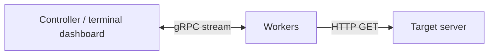

# SwarmGo

[日本語](./README_ja.md) · [MIT license](./LICENSE)

A distributed HTTP load tester written in Go. Start a test from one terminal, send requests from several workers, and watch throughput, progress, and failures in the same dashboard.

The Docker Compose demo runs a controller, three workers, and a target server on your machine. Press **s** to start 9,000 requests, change the worker count to try a different load, or make the target return errors to see how the workers report them.


## Try it locally

Install Docker with Docker Compose, then run:

```bash
git clone https://github.com/ryokotaka/SwarmGo.git
cd SwarmGo
docker compose up -d --build
docker attach "$(docker compose ps -q master)"
```

Wait for `Workers: 3`, then press **s**. Each worker sends 3,000 GET requests to the included `target-server`, with up to 10 requests in flight. That is **9,000 requests and up to 30 concurrent requests** across the three workers.

The dashboard keeps the result after the run finishes. Press **s** to run again, or **q** to cancel active requests and quit the controller. To detach without quitting, press **Ctrl+P**, then **Ctrl+Q**.

Clean up the containers when finished:

```bash
docker compose down
```

Only test systems you own or have permission to test. This example sends traffic inside the local Compose network.

## Change the load

Requests and concurrency are **per worker**. This example runs 5 workers with 1,000 requests each, for 5,000 requests in total:

```bash
TOTAL_REQUESTS=1000 CONCURRENCY=5 docker compose up -d --build --scale worker=5
docker attach "$(docker compose ps -q master)"
```

| Setting | Compose default | Meaning |
| --- | --- | --- |
| `TARGET_URL` | `http://target-server` | URL each worker sends requests to |
| `TOTAL_REQUESTS` | `3000` | Requests per worker per run |
| `CONCURRENCY` | `10` | Maximum in-flight requests per worker |
| `--scale worker=N` | `3` | Number of worker containers |

To see HTTP failures in the dashboard, the included echo server can return errors:

```bash
TARGET_URL='http://target-server/?echo_code=500' TOTAL_REQUESTS=100 docker compose up -d --build
docker attach "$(docker compose ps -q master)"
```

Press **s** and wait for the run to finish. The dashboard should show failed requests grouped under `HTTP 500 Internal Server Error`.

## Run from source

Use **Go 1.25.7 or later**, as specified in [go.mod](./go.mod).

```bash
go build -o swarmgo ./cmd/swarmgo
```

Start a local HTTP server or use an application already running on your machine. For example, with Python 3, serve an empty temporary directory in one terminal:

```bash
python3 -m http.server 8080 --bind 127.0.0.1 --directory "$(mktemp -d)"
```

In another terminal, start the controller:

```bash
./swarmgo master -url http://127.0.0.1:8080 -n 100 -c 5
```

Then start a worker in a third terminal:

```bash
./swarmgo worker
```

Press **s** in the controller. You can start more workers in additional terminals before a run.

The source-build defaults are `http://127.0.0.1:8080`, 5 requests, and concurrency 1. Set the same environment variables as above, or override them with `-url`, `-n`, and `-c`. A worker connects to `localhost:50051` by default; use `-addr host:port` or `MASTER_ADDR` to change it. The controller's port is set with `-p`.

`master -no-tui` starts only the gRPC listener. It does not automatically start a load test or provide a command-line trigger.

## How it works

I built this project to understand Go concurrency and gRPC streaming by making the coordination visible: one controller, several request-sending workers, and a live view of the run.


```mermaid
flowchart LR
    C[Controller / terminal dashboard] <-->|gRPC stream| W[Workers]
    W -->|HTTP GET| T[Target server]
```

The controller sends a start command to the workers connected at the beginning of a run. Each worker uses a fixed-size goroutine pool, sends HTTP requests directly to the target, and reports progress through the same gRPC stream. Workers that connect later join the next run.

The worker keeps listening for commands during a run. Quit, Stop, and a lost controller connection cancel in-flight HTTP requests. The dashboard ignores a second start while a run is active.

Useful entry points in the code:

- [runner.go](./internal/worker/runner.go): HTTP requests, concurrency, and latency samples.
- [client.go](./internal/worker/client.go): worker commands and ordered progress reports.
- [server.go](./internal/master/server.go): connected workers and run state.
- [tui.go](./cmd/swarmgo/tui.go): dashboard and keyboard input.
- [swarm.proto](./proto/swarm.proto): the messages exchanged between controller and workers.

## Measurement details

<details>
<summary>How requests, RPS, latency, and errors are counted</summary>

- **Success / failure:** a request succeeds if its response body is read completely and its final HTTP status is below 400. HTTP 4xx/5xx, connection errors, timeouts, and canceled in-flight requests count as failures. Redirects follow Go's default HTTP client behavior.
- **RPS:** completed requests divided by elapsed wall time for each worker, summed on the dashboard. These are running averages, not instantaneous samples or one precisely synchronized cluster-wide rate. The final values stay on screen after completion.
- **Latency:** time to receive the full response, for successful requests only. Workers calculate nearest-rank P50/P90/P99 when they finish. The dashboard shows the three values from the worker with the highest P99; these are **not pooled percentiles across all workers**. Values are sent as whole milliseconds, so sub-millisecond values may display as `-`.
- **Errors:** grouped reasons arrive with each worker's final report. A disconnected worker may leave partial results; its missing work is not reassigned.

The request queue is bounded by concurrency. Successful latency samples are retained until the run ends, so their memory use grows with the number of successful requests.

</details>

## Scope

SwarmGo currently supports GET requests, a fixed request count, and fixed concurrency. It has no custom headers or bodies, rate scheduling, report export, worker reconnect logic, or TLS/authentication on the control connection. Keep the controller and workers on a trusted network. Compose exposes the controller port only on localhost; the source-built controller listens on all interfaces.

## Development

```bash
go test -race ./...
go vet ./...
go build ./...
```

The tests use local HTTP and gRPC servers. They cover response-body handling, cancellation, result ordering, elapsed-time calculations, and recovery when dashboard notifications are dropped. The same checks run in GitHub Actions.
