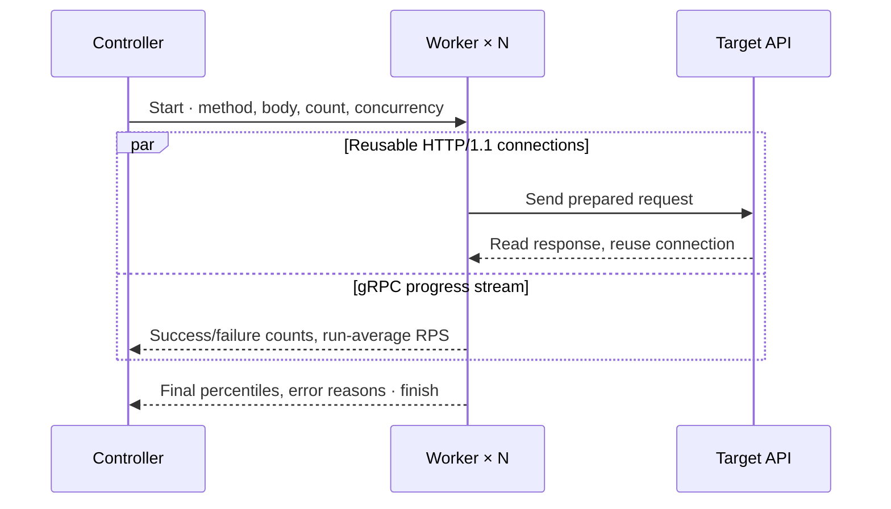

<div align="center">

# SwarmGo

**HTTP load testing with distributed workers and a live dashboard.**

[](go.mod)
[](https://github.com/ryokotaka/SwarmGo/actions/workflows/go.yml)
[](LICENSE)

[Quick start](#quick-start) · [API tests](#test-your-api) · [Benchmarks](#performance-records) · [日本語](README_ja.md)

</div>

SwarmGo sends HTTP traffic from multiple workers and shows throughput, latency and errors in a live terminal dashboard. Use POST bodies and custom headers, automate runs, and save the results as JSON.

**518k POSTs/s over one minute — 4.3× k6 in the recorded local comparison.**

[](benchmarks/throughput/)

## Quick start

With Docker and Docker Compose installed:

```sh
git clone https://github.com/ryokotaka/SwarmGo.git
cd SwarmGo
docker compose up -d --build
docker attach "$(docker compose ps -q master)"
```

Wait for `Workers: 3`, then press **s**. Three workers send **9,000 requests** to the included local server. Throughput, progress and errors stay on screen when the run finishes.

Press **s** to run again, **q** to stop. Clean up with `docker compose down`.


<sub>Recorded run: four million POSTs to a local API. 256 connections, 1 KiB request and response, no rate cap. <a href="assets/demo.json">Recording data</a>.</sub>

## Test your API

Build with Go 1.25.7 or newer: `go build -o swarmgo ./cmd/swarmgo`.

For a local API that accepts JSON at `/api`, save a request body and start a run:

```sh
printf '%s\n' '{"message":"hello"}' > request.json
./swarmgo run -url http://127.0.0.1:8080/api \
  -method POST -body-file request.json -header 'Content-Type: application/json' \
  -workers 1 -n 10000 -c 100 -output report.json
```

Start `./swarmgo worker` in a second terminal. The run starts when the worker connects and writes completed counts, errors and latency percentiles to `report.json`. Exit code `0` means every planned request succeeded.

Add workers on other machines to generate load from more than one host. Request counts and concurrency are set **per worker**.

[Multiple workers, headers, timeouts and report fields →](GUIDE.md)

## Check what happens during a traffic spike

`swarmgo resilience` sends a timed load spike while continuing ordinary requests. It measures their latency, failures and recovery time.

In the included API example, admission control reduced ordinary-request latency during the spike from **3.51 s to 92 ms**. Run the before/after comparison locally:

```sh
python3 examples/resilience/demo.py
```

Requires Go, Python 3 and Docker. [Recorded results and commands →](examples/resilience/)

## Performance records

The opening comparison has no request-rate cap. Rates are counted at the target, after validating each POST body. Tool settings, commands and raw JSON are included with each recording.

| Workload | SwarmGo result | Recording |
| :--- | :--- | :--- |
| Uncapped POSTs, 60 seconds | **518k POSTs/s average** | [Four-tool comparison](benchmarks/throughput/) |
| 200k POSTs/s requested, 5 minutes | **59.7 million successful requests**, 89.7 MiB peak | [Sustained-load trial](benchmarks/arrival/recorded-endurance/) |

<details>
<summary>See throughput over the full minute</summary>


</details>

## How it works


```mermaid
sequenceDiagram
    participant C as Controller
    participant W as Worker × N
    participant A as Target API
    C->>W: Start · method, body, count, concurrency
    par Reusable HTTP/1.1 connections
        W->>A: Send prepared request
        A-->>W: Read response, reuse connection
    and gRPC progress stream
        W-->>C: Success/failure counts, run-average RPS
    end
    W-->>C: Final percentiles, error reasons · finish
```

The controller starts and stops runs and collects results. Workers send HTTP traffic directly to the API. Three choices shape the request path:

- **Reuse work between requests.** A fixed number of goroutines reuse prepared HTTP/1.1 request bytes and their own connections. Each request avoids starting a goroutine or rebuilding the same wire data. [HTTP implementation](internal/worker/direct.go)
- **Keep latency storage bounded.** Results are aggregated in small batches. Successful-request latencies go into HDR histograms instead of a growing list of samples, so latency storage stays bounded as the request count increases. [Execution and aggregation](internal/worker/aggregate.go)
- **Preserve HTTP behavior.** Workers consume response bodies and retain deadlines, cancellation and TLS certificate verification. Redirects and other special cases use Go's standard client. [HTTP tests](internal/worker/direct_test.go)

During a run, workers report success/failure counts and RPS averaged since the start. Final reports add latency percentiles and error reasons. [Metric definitions](GUIDE.md#measurement-details)

```sh
go test -race ./...
go vet ./...
go build ./...
```

<details>
<summary>Benchmark conditions and measurement details</summary>

**Throughput:** Apple M4, local ARM64 Docker, HTTP/1.1, 1 KiB requests and responses. Generator memory: 6 GiB per tool; no CPU quota. Each tool was screened at 64, 256 and 1,024 connections, then measured once for 60 seconds at its fastest observed setting after five seconds of warmup. The generator and target shared the machine. Rates come from the target's validated POST counter. wrk averaged 575,360/s, SwarmGo 517,832/s, oha 414,956/s and k6 119,480/s. These are results for this workload. SwarmGo's later deadline stop and partial report, plus wrk's native timeout counters, are preserved in the [full records](benchmarks/throughput/).

**Five-minute trial:** a different target, 200k/s requested, one trial per tool. SwarmGo had zero HTTP failures and 0.48% missed starts; its original strict verdict remains `inconclusive`. oha reached the same 6 GiB memory budget and stopped after 169 seconds. [Conditions and reports](benchmarks/arrival/recorded-endurance/).

**Overload example:** 3.51 s and 92 ms are the worst one-second p99 values for ordinary requests, before and after admission control on the example API. Both runs sent the complete load schedule. This is the API's improvement, measured with SwarmGo.

**Use:** test systems you own or have permission to test. Keep controller/worker traffic on a trusted network: the control connection has no TLS or authentication. The source-built controller listens on all interfaces; Compose publishes its port on localhost. [Metric definitions and supported behavior](GUIDE.md#measurement-details).

</details>

[MIT license](LICENSE) · [Full usage guide](GUIDE.md)
