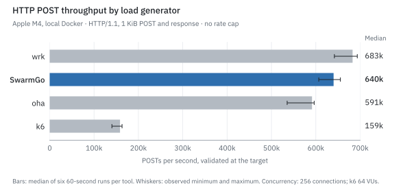
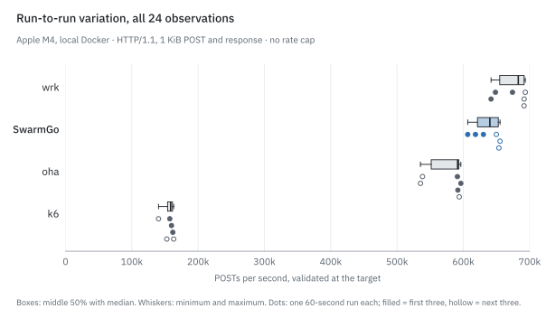
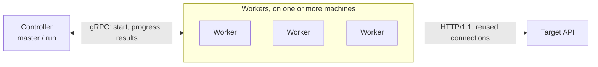

<div align="center">

# SwarmGo

**Test how your service handles heavy traffic.**

[](go.mod)
[](https://github.com/ryokotaka/SwarmGo/actions/workflows/go.yml)
[](LICENSE)

[Quick start](#quick-start) · [Benchmarks](#benchmarks) · [Design](#how-it-works) · [Usage guide](GUIDE.md)

</div>

SwarmGo is an HTTP load-testing tool. You start a controller and one or more workers; the workers send traffic to your API, and the controller shows progress live and saves the results as JSON.

<a href="benchmarks/throughput/rerun-m4/">
<picture>
  <source media="(prefers-color-scheme: dark)" srcset="assets/throughput-m4-dark.svg">
  <source media="(prefers-color-scheme: light)" srcset="assets/throughput-m4.svg">
  
</picture>
</a>

- A single worker sent 640k POSTs per second in this test, about 6% behind wrk and four times k6.
- Workers can run on as many machines as you like. The controller starts them together and combines their results.
- `swarmgo resilience` sends a timed traffic spike and measures ordinary requests while it runs.
- `swarmgo run` writes a JSON report and exits non-zero on failed requests, timeouts or a lost worker, so it can gate a CI pipeline.

## In action

Ten million POSTs to a local API with 256 connections and 1 KiB bodies, finished in 15.4 seconds with no failures ([recording data](assets/demo.json)):


## Quick start

With Docker and Docker Compose installed:

```sh
git clone https://github.com/ryokotaka/SwarmGo.git
cd SwarmGo
docker compose up -d --build
docker attach "$(docker compose ps -q master)"
```

Wait for `Workers: 3`, then press **s**. Three workers send 9,000 requests to the included local server, and the results stay on screen when they finish. Press **s** to run again or **q** to quit, and clean up with `docker compose down`.

POST bodies, custom headers, scripted runs and more workers are covered in the [usage guide](GUIDE.md). Request counts and concurrency are set per worker.

### Without Docker

Install with Go 1.25.7 or later:

```sh
go install github.com/ryokotaka/SwarmGo/cmd/swarmgo@latest
```

| Command | What it does |
| :--- | :--- |
| `swarmgo master` | Controller with the live dashboard. Press **s** to start a run. |
| `swarmgo worker` | Connects to a controller (`-addr`, default `localhost:50051`) and sends the traffic. |
| `swarmgo run` | Waits for workers, runs once, writes a JSON report and exits. |
| `swarmgo resilience` | Sends a timed load spike and measures ordinary requests alongside it. |

`swarmgo <command> -h` lists every option.

### In CI

`swarmgo run` exits with status 0 only when every planned request succeeded:

```sh
swarmgo run -url http://127.0.0.1:8080/health -workers 1 -n 1000 -c 20 -output report.json &
swarmgo worker
wait $!    # non-zero on failed requests, timeouts or a lost worker
```

The report contains request counts, overall RPS, and each worker's P50/P90/P99 latency and error reasons. See [report fields](GUIDE.md#run-once-and-save-the-result).

## Traffic spikes and recovery

`swarmgo resilience` sends a timed load spike and keeps sending ordinary requests alongside it, recording their latency, failures and recovery time. Requests it could not start on schedule are counted too, so a slow target cannot hide its latency by holding up the load.

In the included example API, limiting how many spike requests are admitted brought the worst one-second p99 of ordinary requests during the spike down from 3.51 s to 92 ms.

<a href="examples/resilience/">
<picture>
  <source media="(prefers-color-scheme: dark)" srcset="assets/resilience-dark.svg">
  <source media="(prefers-color-scheme: light)" srcset="assets/resilience.svg">
  
</picture>
</a>

To run the comparison yourself (needs Go, Python 3 and Docker):

```sh
python3 examples/resilience/demo.py
```

The recorded runs and commands are in [examples/resilience](examples/resilience/).

## Benchmarks

Rates are counted at the target, which validates every POST body. Each recording includes its commands, tool settings and raw JSON.

| Test | SwarmGo | Details |
| :--- | :--- | :--- |
| Uncapped 1 KiB POSTs, six 60-second runs | 640k POSTs/s median | [M4 re-measurement](benchmarks/throughput/rerun-m4/) |
| 200k POSTs/s requested for 5 minutes | 59.7 million successful requests, 89.7 MiB peak memory | [Sustained-load trial](benchmarks/arrival/recorded-endurance/) |

In the same session, the build before the [response-header fast path](#how-it-works) reached 628k POSTs/s. The five-minute trial predates it. Earlier throughput recordings are in [benchmarks/throughput](benchmarks/throughput/).

<details>
<summary>Test conditions and all runs</summary>

<picture>
  <source media="(prefers-color-scheme: dark)" srcset="assets/throughput-m4-distribution-dark.svg">
  <source media="(prefers-color-scheme: light)" srcset="assets/throughput-m4-distribution.svg">
  
</picture>

Throughput: MacBook Air with Apple M4, Docker with 10 CPUs and about 7.65 GiB, HTTP/1.1, 1 KiB request and response bodies, no rate cap. Each run had 5 seconds of warmup and 60 seconds of measurement, and all tools were measured in one session in rotating order. SwarmGo, wrk and oha used 256 connections and k6 used 64 VUs, the settings chosen in an earlier screen. Each generator had 6 GiB of memory.

Five-minute trial: a different target, 200k requests per second requested, one run per tool. SwarmGo had no HTTP failures and missed 0.48% of scheduled starts. oha hit its 6 GiB memory limit and stopped after 169 seconds.

</details>

## How it works

The controller and workers talk over gRPC. Workers send HTTP traffic straight to the API; it never passes through the controller.


```mermaid
flowchart LR
    C["Controller<br/>master / run"]
    subgraph W ["Workers, on one or more machines"]
        W1[Worker]
        W2[Worker]
        W3[Worker]
    end
    A[Target API]
    C <-->|"gRPC: start, progress, results"| W
    W -->|"HTTP/1.1, reused connections"| A
```

Most of the performance work is in the worker:

- A fixed pool of goroutines sends prepared HTTP/1.1 request bytes over connections it keeps open, so no request starts a goroutine or rebuilds the same bytes.
- Common HTTP/1.1 responses are parsed in place without allocating, reading only what framing needs: status, length, chunking, encoding and whether the connection can be reused. Anything unusual, such as HTTP/1.0, 1xx responses, redirects or duplicate framing headers, goes to fasthttp's full parser, and a fuzz test checks that the two agree.
- Successful-request latencies go into HDR histograms rather than a growing list, so memory stays flat however many requests a run sends.
- Response bodies are read in full, and deadlines, cancellation and TLS certificate checks still apply. Redirects and other special cases go through Go's standard client.

The code is in [direct.go](internal/worker/direct.go), [direct_head.go](internal/worker/direct_head.go) and [aggregate.go](internal/worker/aggregate.go). During a run, workers report success and failure counts and average RPS; the final report adds latency percentiles and error reasons. [Metric definitions](GUIDE.md#measurement-details) are in the usage guide.

Tests cover cancellation, connection reuse, TLS verification, incomplete runs and agreement between the fast path and fasthttp's parser:

```sh
go test -race ./...
go vet ./...
go build ./...
```

## Use responsibly

Only test systems you own or have permission to test. The controller–worker connection has no TLS or authentication, so keep it on a trusted network. A controller built from source listens on all interfaces; the Compose setup publishes its port on localhost only.

[MIT license](LICENSE) · [Usage guide](GUIDE.md)
