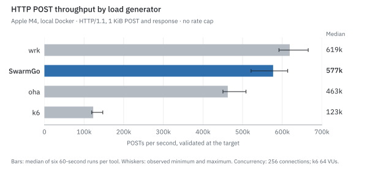
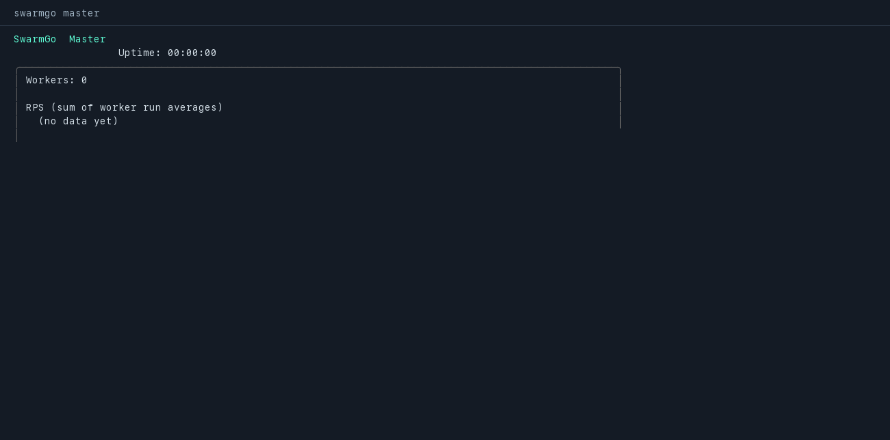
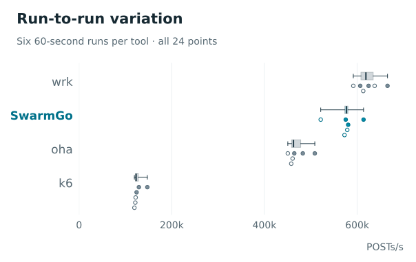
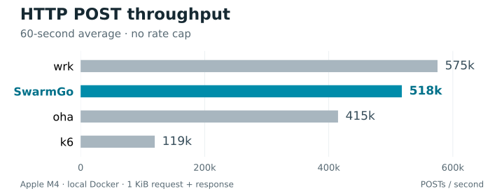
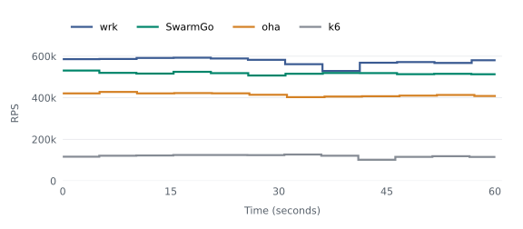
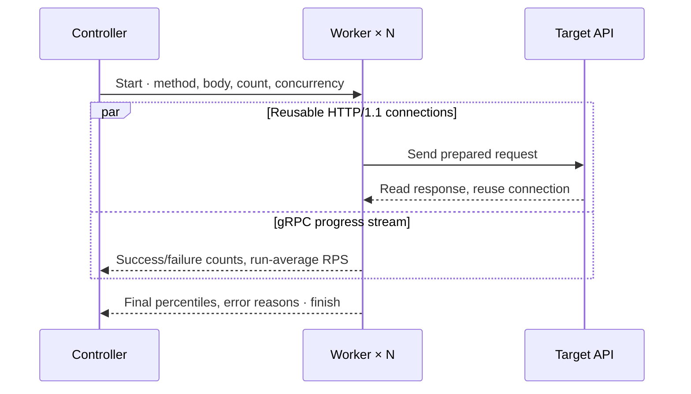

<div align="center">

# SwarmGo

**Test how your service handles heavy traffic.**

[](go.mod)
[](https://github.com/ryokotaka/SwarmGo/actions/workflows/go.yml)
[](LICENSE)

[Quick start](#quick-start) · [Benchmarks](#performance-records) · [Design](#how-it-works) · [Usage guide](GUIDE.md) · [日本語ガイド](GUIDE_ja.md)

</div>

SwarmGo is an HTTP load-testing tool for finding slow responses and failures before users encounter them. Generate traffic from multiple machines, watch one live dashboard, and save the results as JSON.

**Over half a million HTTP requests per second.**

<a href="benchmarks/throughput/repeated/">
<picture>
  <source media="(prefers-color-scheme: dark)" srcset="assets/throughput-repeated-dark.svg">
  <source media="(prefers-color-scheme: light)" srcset="assets/throughput-repeated.svg">
  
</picture>
</a>

Apple M4 · local Docker · 1 KiB request and response. Concurrency: k6 64 VUs; others 256 connections. [Setup and data](benchmarks/throughput/repeated/).

| Strength | What it means |
| :--- | :--- |
| **Fast workers** | 577k POSTs/s median from one machine: within 7% of wrk and 4.7× k6 in the same recording. |
| **Distributed** | Start workers on as many machines as you need; one controller starts them together and collects their results. |
| **Overload you can trust** | `swarmgo resilience` keeps ordinary requests running during a timed spike and records requests it could not start on schedule, so a struggling target cannot hide its latency. |
| **CI-ready** | `swarmgo run` writes a JSON report and exits non-zero on failed requests, timeouts or a lost worker. |

## In action

This recorded run completed **10 million requests in 16.1 seconds**, with **zero failures**.



<sub>Recorded run: ten million POSTs to a local API. 256 connections, 1 KiB request and response, no rate cap. <a href="assets/demo.json">Recording data</a>.</sub>

## Quick start

With Docker and Docker Compose installed:

```sh
git clone https://github.com/ryokotaka/SwarmGo.git
cd SwarmGo
docker compose up -d --build
docker attach "$(docker compose ps -q master)"
```

Wait for `Workers: 3`, then press **s**. Three workers send **9,000 requests** to the included local server. Throughput, progress and errors stay on screen when the run finishes.

Press **s** to run again, **q** to stop. Clean up with `docker compose down`.

For POST bodies, custom headers, scripted runs and additional workers, see the [usage guide](GUIDE.md). Request counts and concurrency are configured per worker.

### Without Docker

Install with Go 1.25.7 or later:

```sh
go install github.com/ryokotaka/SwarmGo/cmd/swarmgo@latest
```

| Command | What it does |
| :--- | :--- |
| `swarmgo master` | Controller with the live dashboard. Press **s** to start a run. |
| `swarmgo worker` | Connects to a controller (`-addr`, default `localhost:50051`) and sends the traffic. |
| `swarmgo run` | Waits for workers, runs once, writes a JSON report and exits. No keypress needed. |
| `swarmgo resilience` | Sends a timed load spike and measures ordinary requests alongside it. |

`swarmgo <command> -h` lists every option.

### In CI

`swarmgo run` exits with status 0 only when every planned request succeeded, so it can gate a pipeline:

```sh
swarmgo run -url http://127.0.0.1:8080/health -workers 1 -n 1000 -c 20 -output report.json &
swarmgo worker
wait $!    # non-zero on failed requests, timeouts or a lost worker
```

The report has request counts, controller-wide RPS, and each worker's P50/P90/P99 and error reasons. [Report fields](GUIDE.md#run-once-and-save-the-result)

## Traffic spikes and recovery

`swarmgo resilience` sends a timed load spike while continuing ordinary requests. It measures their latency, failures and recovery time.

In the included API example, limiting how many load requests are admitted reduced ordinary-request latency from **3.51 s to 92 ms** during the spike (worst one-second p99).

<a href="examples/resilience/"></a>

Run the before/after comparison locally:

```sh
python3 examples/resilience/demo.py
```

Requires Go, Python 3 and Docker. [Recorded results and commands →](examples/resilience/)

## Performance records

The opening comparison has no request-rate cap. Rates are counted at the target, after validating each POST body. Tool settings, commands and raw JSON are included with each recording.

| Workload | SwarmGo result | Recording |
| :--- | :--- | :--- |
| Uncapped POSTs, six 60-second runs | **577k POSTs/s median** | [Four-tool comparison](benchmarks/throughput/repeated/) |
| Earlier four-tool comparison, 60 seconds | **518k POSTs/s**, 4.3× k6 | [Original recording](benchmarks/throughput/) |
| 200k POSTs/s requested, 5 minutes | **59.7 million successful requests**, 89.7 MiB peak | [Sustained-load trial](benchmarks/arrival/recorded-endurance/) |

<sub>These recordings predate the response-header fast path described in [How it works](#how-it-works), which cuts the worker's per-request CPU outside the kernel by about 60% in a micro-benchmark. They have not been re-recorded yet.</sub>

<details>
<summary>See all six runs per tool</summary>

<picture>
  <source media="(prefers-color-scheme: dark)" srcset="assets/throughput-distribution-dark.svg">
  <source media="(prefers-color-scheme: light)" srcset="assets/throughput-distribution.svg">
  
</picture>

Boxes show the middle 50%, with a median line and min–max whiskers. Each dot below is one run: filled for the first three, hollow for the next three per tool. [All 24 recordings](benchmarks/throughput/repeated/).

</details>

<details>
<summary>Earlier four-tool comparison</summary>





</details>

## How it works

For distributed tests (`master` and `run`), the controller sends commands and collects results over gRPC. Workers send HTTP traffic directly to the API; the controller does not forward those requests.


```mermaid
sequenceDiagram
    participant C as Controller
    participant W as Worker × N
    participant A as Target API
    C->>W: Start · method, body, count, concurrency
    par Reusable HTTP/1.1 connections
        W->>A: Send prepared request
        A-->>W: Read response, reuse connection
    and gRPC progress stream
        W-->>C: Success/failure counts, run-average RPS
    end
    W-->>C: Final percentiles, error reasons · finish
```

The performance work is concentrated in the workers:

- **Reuse work between requests.** A fixed number of goroutines reuse prepared HTTP/1.1 request bytes and their own connections. Each request avoids starting a goroutine or rebuilding the same wire data. [HTTP implementation](internal/worker/direct.go)
- **Parse only what framing needs.** Common HTTP/1.1 responses are parsed in place, reading just status, length, chunking, encoding and connection reuse, with no allocation. Anything unusual (HTTP/1.0, 1xx, redirects, folded or duplicate framing headers) falls back to fasthttp's full parser; a fuzz test checks the two agree. [Header fast path](internal/worker/direct_head.go)
- **Keep latency storage bounded.** Results are aggregated in small batches. Successful-request latencies go into HDR histograms instead of a growing list of samples, so latency storage stays bounded as the request count increases. [Execution and aggregation](internal/worker/aggregate.go)
- **Preserve HTTP behavior.** Workers consume response bodies and retain deadlines, cancellation and TLS certificate verification. Redirects and other special cases use Go's standard client. [HTTP tests](internal/worker/direct_test.go)

During a run, workers report success/failure counts and RPS averaged since the start. Final reports add latency percentiles and error reasons. Timed spikes and ordinary-traffic probes use a [separate local runner](internal/resilience/resilience.go). [Metric definitions](GUIDE.md#measurement-details)

Tests cover cancellation, connection reuse, TLS verification, incomplete runs, and agreement between the header fast path and fasthttp's parser:

```sh
go test -race ./...
go vet ./...
go build ./...
```

<details>
<summary>Benchmark conditions and measurement details</summary>

**Repeated throughput:** Apple M4, local ARM64 Docker, 1 KiB POSTs and responses. Six 60-second observations per tool after five seconds of warmup. The earlier setting screen selected 256 connections for SwarmGo, wrk and oha; k6 uses 64 VUs. Bars show medians; thin lines show observed minimum–maximum. All complete comparison observations are included. The tools were measured in separate paired series on the same desktop host, with no CPU quota and a 6 GiB generator memory budget. Native stopping and reporting are outside the observation; process status and memory-limit events are retained in the [raw data and method](benchmarks/throughput/repeated/).

**Earlier four-tool comparison:** Apple M4, local ARM64 Docker, HTTP/1.1, 1 KiB requests and responses. Generator memory: 6 GiB per tool; no CPU quota. Each tool was screened at 64, 256 and 1,024 connections, then measured once for 60 seconds at its fastest observed setting after five seconds of warmup. The generator and target shared the machine. Rates come from the target's validated POST counter. wrk averaged 575,360/s, SwarmGo 517,832/s, oha 414,956/s and k6 119,480/s. These are results for this workload. SwarmGo's later deadline stop and partial report, plus wrk's native timeout counters, are preserved in the [full records](benchmarks/throughput/).

**Five-minute trial:** a different target, 200k/s requested, one trial per tool. SwarmGo had zero HTTP failures and 0.48% missed starts; its original strict verdict remains `inconclusive`. oha reached the same 6 GiB memory budget and stopped after 169 seconds. [Conditions and reports](benchmarks/arrival/recorded-endurance/).

**Overload example:** 3.51 s and 92 ms are the worst one-second p99 values for ordinary requests, before and after admission control on the example API. Both runs sent the complete load schedule. This is the API's improvement, measured with SwarmGo.

**Use:** test systems you own or have permission to test. Keep controller/worker traffic on a trusted network: the control connection has no TLS or authentication. The source-built controller listens on all interfaces; Compose publishes its port on localhost. [Metric definitions and supported behavior](GUIDE.md#measurement-details).

</details>

[MIT license](LICENSE) · [Full usage guide](GUIDE.md)
