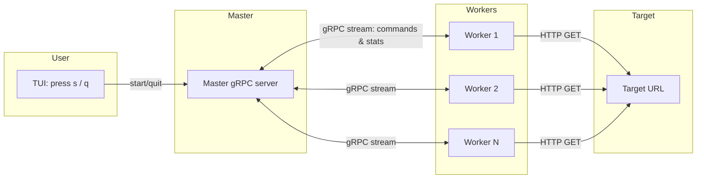

<div align="center">

# **SwarmGo**

[](https://go.dev/)
[](https://grpc.io/)
[](https://www.docker.com/)
[](./LICENSE)
[](./README_ja.md)

<br>

**A small Go/gRPC load-testing demo with a live terminal dashboard.**

SwarmGo runs one controller, multiple request-sending Workers, and a local target server with Docker Compose. The demo needs no cloud server, external API, or Go install: start it, press **`s`**, and watch worker coordination, RPS, latency, success/failure counts, and grouped errors update in real time.

<br>

---

</div>

## Demo

The Docker Compose demo starts one controller, three request-sending workers, and a local `target-server`.

<div align="center">


</div>

The terminal dashboard shows connected workers, progress, RPS, P50/P90/P99 latency, success/failure counts, and common error reasons while the test is running. The default demo stays inside Docker Compose, so you can try the project without sending traffic to a real external service.

---

## Why it is worth a look

SwarmGo is not trying to replace mature tools like k6, wrk, or Vegeta. It is a compact project that makes the moving parts of distributed load generation easy to run and inspect:

- one Master broadcasts commands to many Workers over long-lived gRPC streams
- Workers generate HTTP traffic concurrently and stream stats back to the Master
- the TUI makes normally hidden behavior visible: RPS, latency percentiles, progress, success/failure counts, and grouped errors
- the built-in `target-server` makes success, higher-load runs, and mixed-failure demos safe to run locally
- the codebase is small enough to read after the demo

---

## At a glance

| Area | Status |
|------|--------|
| **Working demo** | Docker Compose starts one controller, three workers, and a local target server. |
| **Load test scope** | HTTP GET requests with configurable target URL, total requests, and concurrency. |
| **Live visibility** | Terminal dashboard shows workers, RPS, progress, latency percentiles, success/failure counts, and top errors. |
| **Local checks** | Includes a 25,000-request run, a 100,000-request run, and a mixed 404/500 failure demo against `target-server`. |
| **Best for** | Trying load testing basics, then reading a small Go/gRPC distributed systems project. |
| **Not meant for** | Production-grade benchmarking or replacing mature tools like k6, wrk, or Vegeta. |

---

## Quickstart: local only

### Local Docker demo

Requires Docker and Docker Compose. You do not need to install Go for this demo.

```bash
git clone https://github.com/ryokotaka/SwarmGo.git
cd SwarmGo
docker compose up -d --build
docker attach $(docker compose ps -q master)
```

When the terminal dashboard opens, press **`s`** to send test traffic to the built-in `target-server`.

### What you should see

After the workers connect and the run starts, the terminal dashboard should show:

- `Workers: 3` by default.
- `Total RPS (realtime)` changing from `(no data yet)` to an ASCII graph and total requests-per-second value.
- `Success`, `Fail`, `Progress: current / total (%)`, and latency values updating during the run.
- `Errors: None` for the healthy local target, or grouped error reasons when requests fail.

To stop the demo:

- Press **`q`** to quit the controller and stop the run.
- Detach without stopping the controller with `Ctrl+P`, then `Ctrl+Q`.
- Clean up with:

```bash
docker compose down
```

> Safety: only run load tests against systems you own or have explicit permission to test. The default quickstart targets the local `target-server` container.

---

## Local-only checks

<details>
<summary>Show the local 25,000 / 100,000 request runs and mixed-failure demo</summary>

SwarmGo can be tested at a higher load without using a cloud server or sending traffic to a public website. The run below keeps all test traffic inside the local Docker Compose network:

```bash
TOTAL_REQUESTS=5000 CONCURRENCY=20 docker compose up -d --build --scale worker=5
docker attach $(docker compose ps -q master)
```

Press **`s`** in the TUI to start the run. The default target remains the local `target-server` container.

Example result from one local run:

| Item | Value |
|------|-------|
| Target | `http://target-server` inside Docker Compose |
| Workers | 5 |
| Requests | 25,000 total (`5,000` per Worker) |
| Concurrency | 100 total (`20` per Worker) |
| Result | 25,000 success, 0 fail |
| Observed RPS | roughly 6.6k-6.8k RPS while the run was active |

### Heavier local run

I also ran a larger local-only test for the README. It uses the same Docker Compose `target-server`; it is not included in the demo GIF because the run is longer and more dependent on the local machine.

```bash
TOTAL_REQUESTS=10000 CONCURRENCY=20 docker compose up -d --build --scale worker=10
docker attach $(docker compose ps -q master)
```

Example result from one local run:

| Item | Value |
|------|-------|
| Target | `http://target-server` inside Docker Compose |
| Workers | 10 |
| Requests | 100,000 total (`10,000` per Worker) |
| Concurrency | 200 total (`20` per Worker) |
| Result | 100,000 success, 0 fail |
| TUI errors | `Errors: None` |
| Realtime RPS | roughly 6.3k-7.1k RPS while most workers were active |

The worker logs for that run also ended with `total=10000 success=10000 failed=0` for each of the 10 workers.

This is a local sanity/stress test, not a claim about public-internet performance. Results depend on the machine, Docker runtime, and target server. To avoid accidental abuse or unexpected cost, keep the target as `http://target-server` unless you own the system and have permission to test it.

Clean up after the run:

```bash
docker compose down
```

### Local mixed-failure example

The TUI can also show grouped failure reasons without testing a real external service. The local `target-server` can return a mix of `200`, `404`, and `500` responses:

```bash
TARGET_URL='http://target-server/?echo_code=200-200-404-500' TOTAL_REQUESTS=300 CONCURRENCY=10 docker compose up -d --build --scale worker=3
docker attach $(docker compose ps -q master)
```

Press **`s`** to start. Some requests succeed, while HTTP `404` and `500` responses are counted as failures and grouped by reason:

```text
Success: 468   Fail: 432
Errors:
  - HTTP 500 500 Internal Server Error: 226
  - HTTP 404 404 Not Found: 206
```

The exact counts can vary because the local echo server chooses from the configured response codes, but the run stays inside Docker Compose.

</details>

---

## Features

| Feature | Description |
|--------|-------------|
| **Distributed Master/Worker model** | One Master coordinates many Workers over long-lived gRPC streams. |
| **Stable concurrency model** | Each Worker uses a fixed-size worker pool instead of spawning one goroutine per request. |
| **Latency percentiles** | Workers report P50/P90/P99 latency for successful requests. |
| **Top error reasons** | Network errors and HTTP 4xx/5xx responses are counted as failures and grouped for the TUI. |
| **Headless Master** | Use `-no-tui` when you only need the gRPC Master for scripts, CI, or remote runs. |

---

## Docker Options

### Scale Workers

The compose file starts 3 Workers by default. To run more Workers:

```bash
docker compose up -d --build --scale worker=5
```

### Change target, requests, or concurrency

By default, Docker Compose points SwarmGo at the included `target-server`:

```env
TARGET_URL=http://target-server
TOTAL_REQUESTS=3000
CONCURRENCY=10
```

For the safest local demo, leave `TARGET_URL` unchanged. To test another target that you own or have explicit permission to test, create a `.env` file in the project root:

```bash
TARGET_URL=https://your-api.example.com
TOTAL_REQUESTS=100
CONCURRENCY=10
```

Then run:

```bash
docker compose up -d --build
```

You can also override values for a single run:

```bash
TARGET_URL=https://your-api.example.com TOTAL_REQUESTS=100 CONCURRENCY=10 docker compose up -d --build
```

### Foreground mode

If you only want logs in one terminal:

```bash
docker compose up --build
```

Interactive TUI input works best with the background + `docker attach` flow above.

---

## Run without Docker

Requires **Go 1.22+**.

```bash
go mod tidy
go build -o swarmgo ./cmd/swarmgo/
```

Terminal 1: start the Master.

```bash
./swarmgo master -p 50051
```

Optional Master flags:

```bash
./swarmgo master -p 50051 -url https://example.com -n 100 -c 10
```

Terminal 2 and more: start Workers.

```bash
./swarmgo worker
```

Workers connect to `localhost:50051` by default. Use `-addr host:port` or `MASTER_ADDR` for a remote Master.

---

## Architecture

1. The **Master** starts a gRPC server and keeps track of connected Workers.
2. Each **Worker** opens one long-lived bidirectional gRPC stream to the Master.
3. The Master sends commands over that stream. Workers send register, stats, and finish messages back over the same stream.
4. During a run, Workers send HTTP GET requests directly to the target URL and periodically report progress.

The Master does not proxy HTTP traffic. It coordinates Workers and aggregates their reports; the Workers generate the load directly.

| Flow | What happens |
|------|--------------|
| Start | The TUI sends a start command to the Master, and the Master broadcasts it to every connected Worker. |
| Load | Each Worker runs a fixed-size worker pool and sends HTTP GET requests to the configured target URL. |
| Report | Workers stream progress, latency, success/failure counts, and final error reasons back to the Master. |
| Display | The Master passes those updates to the TUI, which renders worker count, RPS, progress, latency, and top errors. |


```mermaid
flowchart LR
    subgraph User
        TUI[TUI: press s / q]
    end
    subgraph Master
        M[Master gRPC server]
    end
    subgraph Workers
        W1[Worker 1]
        W2[Worker 2]
        WN[Worker N]
    end
    subgraph Target
        URL[Target URL]
    end
    TUI -->|start/quit| M
    M <-->|gRPC stream: commands & stats| W1
    M <-->|gRPC stream| W2
    M <-->|gRPC stream| WN
    W1 & W2 & WN -->|HTTP GET| URL
```

---

## Design Notes

I built SwarmGo to learn distributed systems, Go concurrency, gRPC streaming, and Docker-based local environments by implementing a working tool end to end.

### Worker pool instead of one goroutine per request

The first version used one goroutine per HTTP request. That works for small runs, but very large totals can create too many goroutines and allocations. SwarmGo now uses a fixed-size worker pool per Worker, so memory usage scales with concurrency instead of total request count.

### Bidirectional gRPC streams

Each Worker keeps one bidirectional stream open to the Master. The Master can send Start / Stop / Quit commands while the Worker sends register, stats, and finish messages back without switching protocols or polling.

### Safe Worker registry

The Master stores connected Workers in a shared map protected by a mutex. Broadcasts copy the current Worker streams under the lock, release the lock, then send commands, avoiding long lock holds around network operations.

### TUI and gRPC in one process

The Master runs the gRPC server and TUI together. gRPC handlers push updates into a channel, and the TUI consumes those updates to stay responsive while Workers connect and report stats.

### HTTP failure handling

SwarmGo treats both network errors and HTTP status codes >= 400 as failures. Go's HTTP client does not return an error for 4xx/5xx responses, so Workers check the status code explicitly and aggregate top error reasons for the TUI.

---

## Limitations

- HTTP requests are currently **GET only**.
- Custom headers, request bodies, and POST/PUT-style scenarios are not supported yet.
- Results are shown in the TUI/logs; report export is not implemented yet.
- There is no ramp-up schedule or advanced scenario scripting yet.
- SwarmGo is a small distributed load testing project, not a production benchmark suite.

---

## Roadmap

- Custom headers.
- POST/body support.
- JSON or CSV report export.
- Ramp-up and duration-based runs.
- Per-worker summary view after each run.

---

## License

**MIT**
