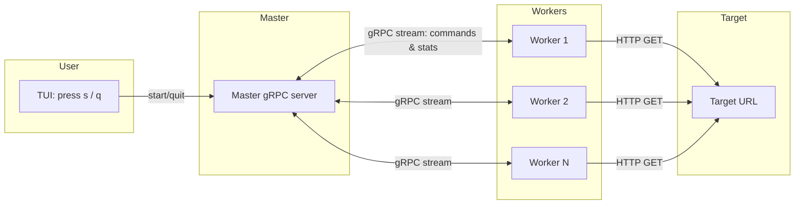

<div align="center">

# **SwarmGo**

[](https://go.dev/)
[](https://grpc.io/)
[](https://www.docker.com/)
[](./LICENSE)
[](./README_ja.md)

<br>

**Send test traffic to a website or API and watch how it responds in real time.**

SwarmGo starts a terminal dashboard, several request-sending workers, and a local test server with Docker Compose. You can run the demo first, then open the code to see how the controller and workers coordinate behind the scenes.

<br>

---

</div>

## Demo

The Docker Compose demo starts one controller, three request-sending workers, and a local `target-server`, so you can try SwarmGo without preparing an external API.

<div align="center">


</div>

The terminal dashboard shows connected workers, progress, RPS, P50/P90/P99 latency, success/failure counts, and common error reasons while the test is running.

---

## What it does

Load testing means sending repeated requests to a website or API to see how steadily it responds. SwarmGo keeps that idea small and visible:

- press **`s`** to start a test
- watch RPS (requests per second), latency (how long responses take), success/failure counts, and errors
- run the demo locally against a built-in test server
- inspect the code later if you want to see how the controller and workers coordinate

---

## Quickstart

### Local Docker demo

Requires Docker and Docker Compose. You do not need to install Go for this demo.

```bash
git clone https://github.com/ryokotaka/SwarmGo.git
cd SwarmGo
docker compose up -d --build
docker attach $(docker compose ps -q master)
```

When the terminal dashboard opens, press **`s`** to send test traffic to the built-in `target-server`.

### What you should see

After the workers connect and the run starts, the terminal dashboard should show:

- `Workers: 3` by default.
- `Total RPS (realtime)` changing from `(no data yet)` to an ASCII graph and total requests-per-second value.
- `Success`, `Fail`, `Progress: current / total (%)`, and latency values updating during the run.
- `Errors: None` for the healthy local target, or grouped error reasons when requests fail.

To stop the demo:

- Press **`q`** to quit the controller and stop the run.
- Detach without stopping the controller with `Ctrl+P`, then `Ctrl+Q`.
- Clean up with:

```bash
docker compose down
```

> Safety: only run load tests against systems you own or have explicit permission to test. The default quickstart targets the local `target-server` container.

---

## At a glance

| Area | Status |
|------|--------|
| **Working demo** | Docker Compose starts one controller, three workers, and a local target server. |
| **Load test scope** | HTTP GET requests with configurable target URL, total requests, and concurrency. |
| **Live visibility** | Terminal dashboard shows workers, RPS, progress, latency percentiles, success/failure counts, and top errors. |
| **Best for** | Trying load testing basics, then reading a small Go/gRPC distributed systems project. |
| **Not meant for** | Production-grade benchmarking or replacing mature tools like k6, wrk, or Vegeta. |

---

## What is SwarmGo?

**SwarmGo** is built around a simple Master/Worker architecture.

- **Master:** runs a gRPC server and optional TUI. It broadcasts Start / Stop / Quit commands to connected Workers.
- **Workers:** connect to the Master, execute HTTP GET requests with a fixed-size worker pool, and stream stats back over gRPC.
- **Target:** receives HTTP traffic directly from Workers. The Master coordinates the run but does not proxy requests.

The goal is not to be the biggest load testing tool. The goal is to make the mechanics of distributed load generation easy to run, inspect, and extend.

---

## Why this project?

I built SwarmGo to understand the moving parts of a distributed system by implementing them directly:

- long-lived bidirectional gRPC streams
- Master-to-Worker command broadcast
- Worker-side concurrency control
- live progress reporting from multiple processes
- Docker Compose networking for a local multi-service setup

It is intentionally small enough to read, but complete enough to run as a real multi-process demo.

---

## Features

| Feature | Description |
|--------|-------------|
| **Distributed Master/Worker model** | One Master coordinates many Workers over long-lived gRPC streams. |
| **One-command local demo** | Docker Compose starts the Master, Workers, and a dummy target server. |
| **Interactive TUI** | Press **`s`** to start a run and **`q`** to quit. Watch Workers, RPS, latency, success/failure counts, and errors. |
| **Configurable target and load** | Set the target URL, total requests, and concurrency with `-url`, `-n`, `-c`, or environment variables. |
| **Stable concurrency model** | Each Worker uses a fixed-size worker pool instead of spawning one goroutine per request. |
| **Latency percentiles** | Workers report P50/P90/P99 latency for successful requests. |
| **Top error reasons** | Network errors and HTTP 4xx/5xx responses are counted as failures and grouped for the TUI. |
| **Headless Master** | Use `-no-tui` when you only need the gRPC Master for scripts, CI, or remote runs. |

---

## Docker Options

### Scale Workers

The compose file starts 3 Workers by default. To run more Workers:

```bash
docker compose up -d --build --scale worker=5
```

### Change target, requests, or concurrency

By default, Docker Compose points SwarmGo at the included `target-server`:

```env
TARGET_URL=http://target-server
TOTAL_REQUESTS=3000
CONCURRENCY=10
```

To test another target, create a `.env` file in the project root:

```bash
TARGET_URL=https://your-api.example.com
TOTAL_REQUESTS=100
CONCURRENCY=10
```

Then run:

```bash
docker compose up -d --build
```

You can also override values for a single run:

```bash
TARGET_URL=https://your-api.example.com TOTAL_REQUESTS=100 CONCURRENCY=10 docker compose up -d --build
```

### Foreground mode

If you only want logs in one terminal:

```bash
docker compose up --build
```

Interactive TUI input works best with the background + `docker attach` flow above.

---

## Run without Docker

Requires **Go 1.22+**.

```bash
go mod tidy
go build -o swarmgo ./cmd/swarmgo/
```

Terminal 1: start the Master.

```bash
./swarmgo master -p 50051
```

Optional Master flags:

```bash
./swarmgo master -p 50051 -url https://example.com -n 100 -c 10
```

Terminal 2 and more: start Workers.

```bash
./swarmgo worker
```

Workers connect to `localhost:50051` by default. Use `-addr host:port` or `MASTER_ADDR` for a remote Master.

---

## Architecture

1. The **Master** starts a gRPC server and keeps track of connected Workers.
2. Each **Worker** opens one long-lived bidirectional gRPC stream to the Master.
3. The Master sends commands over that stream. Workers send register, stats, and finish messages back over the same stream.
4. During a run, Workers send HTTP GET requests directly to the target URL and periodically report progress.


```mermaid
flowchart LR
    subgraph User
        TUI[TUI: press s / q]
    end
    subgraph Master
        M[Master gRPC server]
    end
    subgraph Workers
        W1[Worker 1]
        W2[Worker 2]
        WN[Worker N]
    end
    subgraph Target
        URL[Target URL]
    end
    TUI -->|start/quit| M
    M <-->|gRPC stream: commands & stats| W1
    M <-->|gRPC stream| W2
    M <-->|gRPC stream| WN
    W1 & W2 & WN -->|HTTP GET| URL
```

---

## Design Notes

I built SwarmGo to learn distributed systems, Go concurrency, gRPC streaming, and Docker-based local environments by implementing a working tool end to end.

### Worker pool instead of one goroutine per request

The first version used one goroutine per HTTP request. That works for small runs, but very large totals can create too many goroutines and allocations. SwarmGo now uses a fixed-size worker pool per Worker, so memory usage scales with concurrency instead of total request count.

### Bidirectional gRPC streams

Each Worker keeps one bidirectional stream open to the Master. The Master can send Start / Stop / Quit commands while the Worker sends register, stats, and finish messages back without switching protocols or polling.

### Safe Worker registry

The Master stores connected Workers in a shared map protected by a mutex. Broadcasts copy the current Worker streams under the lock, release the lock, then send commands, avoiding long lock holds around network operations.

### TUI and gRPC in one process

The Master runs the gRPC server and TUI together. gRPC handlers push updates into a channel, and the TUI consumes those updates to stay responsive while Workers connect and report stats.

### HTTP failure handling

SwarmGo treats both network errors and HTTP status codes >= 400 as failures. Go's HTTP client does not return an error for 4xx/5xx responses, so Workers check the status code explicitly and aggregate top error reasons for the TUI.

---

## Limitations

- HTTP requests are currently **GET only**.
- Custom headers, request bodies, and POST/PUT-style scenarios are not supported yet.
- Results are shown in the TUI/logs; report export is not implemented yet.
- There is no ramp-up schedule or advanced scenario scripting yet.
- SwarmGo is a small distributed load testing project, not a production benchmark suite.

---

## Roadmap

- Custom headers.
- POST/body support.
- JSON or CSV report export.
- Ramp-up and duration-based runs.
- Per-worker summary view after each run.

---

## License

**MIT**
