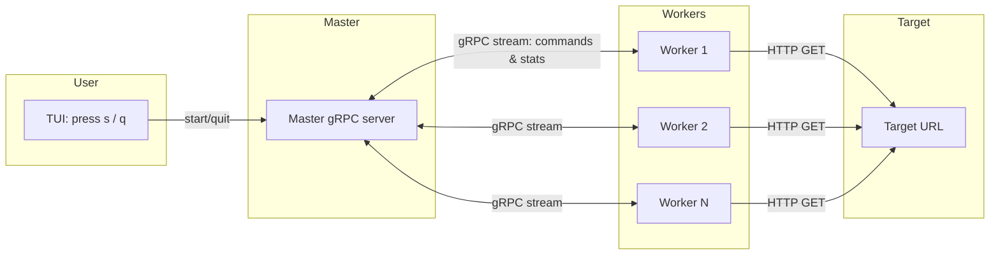

<div align="center">

# **SwarmGo**

[](https://go.dev/)
[](https://grpc.io/)
[](https://www.docker.com/)
[](./LICENSE)
[](./README_ja.md)

<br>

**A distributed HTTP load testing tool** — one **Master** coordinates many **Workers** over **gRPC**. Each Worker uses a **worker pool** so memory stays stable even under heavy concurrency.

*I built this to learn distributed systems, **Go**, and **gRPC** hands-on.*

<br>

---

### 📺 Output / Demo

*See what the tool does at a glance: **Docker Compose** quickstart → Master TUI with connected Workers, live RPS, and success/fail counts.*


**What you see:** `docker compose up -d --build` → attach to Master → press **`s`** to start a load test, **`q`** to quit. Connected Worker count, live RPS graph, success/fail counters, and a log of connect/disconnect/finish events.

</div>

---

## 📖 What is SwarmGo?

**SwarmGo** is a distributed HTTP load testing tool. You run a single **Master** (with an optional TUI dashboard) and one or more **Workers**. The Master sends commands (Start / Stop / Quit) over **gRPC**; Workers connect to the Master, run HTTP GET requests against a target URL, and stream back stats (RPS, success/fail counts) and finish events. Scale by adding more Worker processes or machines — no single process has to handle millions of requests alone.

---


## 🏗 Architecture Overview

1. **Master** runs a **gRPC** server (and optionally a TUI). It keeps a list of connected Workers; each connection is a long-lived **bidirectional gRPC stream**.
2. **Workers** connect to the Master and send a **Register** message with their ID, then sit in a loop **receiving** commands (Start / Stop / Quit) and **sending** back messages (Stats during a run, **Finish** when done).
3. When you press **Start** in the TUI, the Master **broadcasts** a Start command to all connected Workers. Each Worker runs an HTTP load test (GET requests to a target URL) using a **fixed-size worker pool** and periodically sends **Stats** (success/fail counts, RPS) back to the Master. When a Worker finishes, it sends **Finish**; the Master updates the dashboard.

So: **one stream per Worker**. The Master sends commands; the Worker sends register/stats/finish. The actual HTTP traffic goes from each Worker to the **target URL** — the Master never sees the HTTP requests.


```mermaid
flowchart LR
    subgraph User
        TUI[TUI: press s / q]
    end
    subgraph Master
        M[Master gRPC server]
    end
    subgraph Workers
        W1[Worker 1]
        W2[Worker 2]
        WN[Worker N]
    end
    subgraph Target
        URL[Target URL]
    end
    TUI -->|start/quit| M
    M <-->|gRPC stream: commands & stats| W1
    M <-->|gRPC stream| W2
    M <-->|gRPC stream| WN
    W1 & W2 & WN -->|HTTP GET| URL
```

- **Solid lines:** **gRPC** (Master ↔ Workers) and HTTP (Workers → Target).
- **Master** holds one stream per Worker and broadcasts Start/Stop/Quit to all.
- **Workers** send **Register** once, then **Stats** and **Finish** over the same stream.

---

## 🚀 How to Run (Quickstart)

The easiest way is **Docker Compose**: one command brings up the Master and several Workers. No need to install **Go** locally.

### Step 1: Clone and go to the project

```bash
git clone https://github.com/ryokotaka/SwarmGo.git
cd SwarmGo
```

### Step 2: Start Master and Workers in the background

```bash
docker compose up -d --build
```

- **Master:** runs with TUI, exposes **gRPC** on port `50051`.
- **Workers:** by default 3 Workers start; they connect to `master:50051` via **Docker** network.

To change the number of Workers (e.g. 5):

```bash
docker compose up -d --build --scale worker=5
```

To use a different target URL (and/or request count, concurrency) when you press **`s`** in the TUI, set environment variables. The Master reads **`TARGET_URL`**, **`TOTAL_REQUESTS`**, and **`CONCURRENCY`** as defaults. Easiest: put them in a **`.env`** file in the project root — then you only run `docker compose up -d --build` as usual (no long command line).

```bash
# Example .env in the project root:
TARGET_URL=https://your-api.example.com
TOTAL_REQUESTS=100
CONCURRENCY=10
```

Or override once without editing a file:  
`TARGET_URL=https://your-api.example.com TOTAL_REQUESTS=100 CONCURRENCY=10 docker compose up -d --build`

### Step 3: Attach to the Master to use the TUI

The Master is running in the background. To see and control its TUI:

```bash
docker attach $(docker compose ps -q master)
```

- Press **`s`** to start a load test (Workers will run and report stats).
- Press **`q`** to quit the Master (it will send Quit to Workers and exit).
- To **detach** without stopping the Master: `Ctrl+P` then `Ctrl+Q`. The container keeps running; you can `docker attach` again later.

### Step 4: Stop everything

```bash
docker compose down
```


### Optional: Run in the foreground (logs in one terminal)

If you prefer to see all logs in one place and stop with Ctrl+C:

```bash
docker compose up --build
```

You won't get the interactive TUI in this mode; use the attach method above for TUI interaction.

---

## 📦 Features

| Feature | Description |
|--------|-------------|
| **Master + Workers over gRPC** | One Master commands many Workers; scale by adding more Workers. |
| **TUI dashboard** | See connected Workers, live RPS, success/fail counts, and event log. **`s`** = start test, **`q`** = quit. |
| **Configurable target / n / c** | Target URL, total requests, and concurrency via **`-url`** **`-n`** **`-c`** or env vars **`TARGET_URL`** **`TOTAL_REQUESTS`** **`CONCURRENCY`** (used as defaults when flags are omitted; ideal for Docker Compose). |
| **Worker pool** | Fixed-size pool per Worker so memory stays stable under high concurrency (no OOM from millions of **goroutine**s). |
| **Headless Master** | Use `-no-tui` for a **gRPC**-only Master (CI, scripts, remote servers). |

---

## 🛠 Run without Docker (local Go)

Requires **Go 1.22+**.

```bash
go mod tidy
go build -o swarmgo ./cmd/swarmgo/
```

1. **Terminal 1 — Master:**  
   `./swarmgo master -p 50051`  
   Optional: `-url`, `-n`, `-c` set the load test params used when you press **`s`** in the TUI. If omitted, they default to the **`TARGET_URL`**, **`TOTAL_REQUESTS`**, and **`CONCURRENCY`** environment variables (or `https://example.com`, `5`, `1`).  

2. **Terminal 2 (and more) — Workers:**  
   `./swarmgo worker`  
   (Defaults to `localhost:50051`. Override with `-addr host:port` or `MASTER_ADDR`.)

3. In the Master TUI, press **`s`** to start a test, **`q`** to quit.

---

## 🧠 What I Learned / Challenges

Building SwarmGo taught me a lot about concurrency, **gRPC**, and keeping the system simple. Here are the main challenges and how I addressed them.

### 1. Goroutines and memory (OOM)

**Problem:** My first approach was "one **goroutine** per HTTP request." For small loads it was fine, but for large runs (e.g. 1 million requests) the process ran out of memory because of the huge number of goroutines and associated allocations.

**Solution:** I switched to a **worker pool** pattern. Instead of spawning N goroutines for N requests, each Worker has a **fixed number** of worker goroutines (the concurrency level). A **buffered channel** acts as a job queue: one goroutine produces "jobs" (one per request), and the fixed workers consume from the channel and execute HTTP requests. Memory stays **O(concurrency)** instead of O(total requests), so it stays stable even for very large totals.

### 2. gRPC connection and streaming

**Problem:** I needed the Master to send commands (Start/Stop/Quit) and Workers to send back events (Register, Stats, Finish) without blocking each other. Simple request-response wasn't enough.

**Solution:** I used a single **bidirectional streaming** RPC (`Connect`): one long-lived stream per Worker. The Worker sends `WorkerMsg` (register, stats, finish) and receives `MasterCmd` (start, stop, quit). Both sides can send at any time. Connection lifecycle is clear: first message from Worker must be **Register**; when the stream closes, the Master removes that Worker from the list.

### 3. Safe concurrent access to the Worker list

**Problem:** The Master holds a `map[workerID]stream` that is read and written from multiple **goroutine**s (each `Connect` handler is its own goroutine, and the TUI or Start action may broadcast at the same time). Unsynchronized access would cause races and panics.

**Solution:** A **mutex** guards the map. When broadcasting, I don't hold the lock while calling `stream.Send()` (which can block). Instead, I take a **snapshot** of the map (copy of keys and streams) under the lock, release the lock, then iterate over the snapshot and send. That way the critical section is short and we avoid deadlocks or long blocks on the mutex.

### 4. TUI and gRPC on the same process

**Problem:** The Master runs both a **gRPC** server and a TUI that must stay responsive (key presses, periodic redraws). Blocking the main loop on gRPC would freeze the UI.

**Solution:** The gRPC server runs in the same process; each `Connect` runs in its own **goroutine**. The TUI runs in the main goroutine (or its own loop) and receives updates via a **channel**: the gRPC handlers send events (e.g. "worker connected", "stats update") to this channel with non-blocking sends (using `select` with `default`), and the TUI reads from the channel and redraws. So the UI stays responsive and the gRPC handlers don't block each other.

### 5. Docker: TUI and multiple Workers

**Problem:** I wanted to run the Master with a TUI and multiple Workers with a single command, without installing **Go**.

**Solution:** `docker-compose` with a **master** service (with `stdin_open` and `tty` for interactive TUI) and a **worker** service with `deploy.replicas: 3`. The master runs a simple `command: ["master", "-p", "50051"]`; target URL, request count, and concurrency are set via **`TARGET_URL`**, **`TOTAL_REQUESTS`**, and **`CONCURRENCY`** in the service `environment`, and the Go binary reads them as flag defaults so the compose file stays simple. Workers use `MASTER_ADDR=master:50051` so they reach the Master by service name. To use the TUI, you run `docker compose up -d` and then `docker attach` to the master container; that gives you the interactive terminal for **`s`** / **`q`**.

### 6. Container base image and TLS certificates

**Problem:** With the Worker run image based on minimal **`alpine`**, root certificates were missing, so HTTPS load tests hit **`x509`** verification errors and every request failed.

**Solution:** I used **`INSECURE_SKIP_VERIFY=1`** as a temporary workaround for dev/demo, then moved the run stage to a **`debian-slim`** base and installed `ca-certificates` for a proper fix. Learned that base image and certificate setup directly affect whether a distributed setup works or fails — an infra detail that's easy to miss until you hit it.

---

## 🗺 Roadmap

- [x] Configurable target URL, request count, and concurrency via `master -url -n -c` and env vars `TARGET_URL`, `TOTAL_REQUESTS`, `CONCURRENCY` (e.g. in Docker Compose)
- [ ] Real-time progress in the TUI
- [ ] Support for POST and other HTTP methods
- [ ] Latency distribution (e.g. P50, P99)

---

## 📜 License

**MIT**
