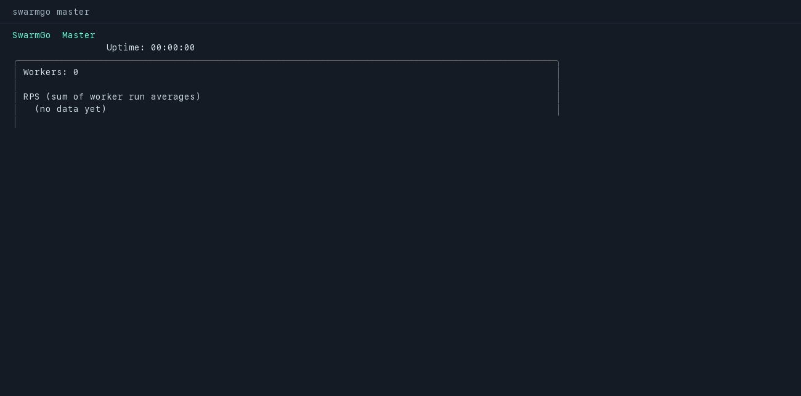
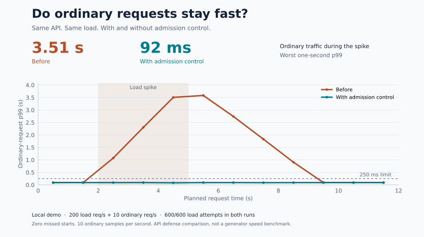
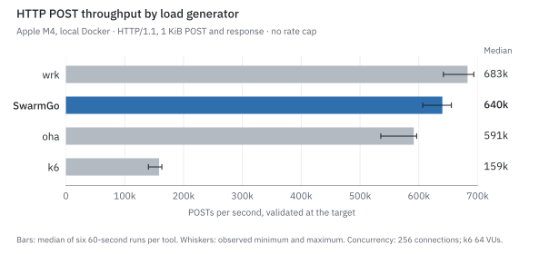
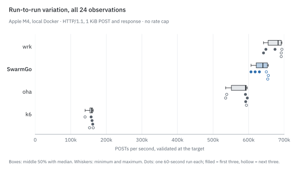
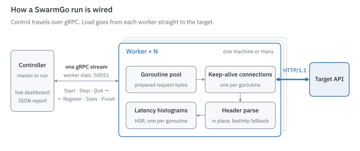

<div align="center">

# SwarmGo

**Test how your service handles heavy traffic.**

[](go.mod)
[](https://github.com/ryokotaka/SwarmGo/actions/workflows/go.yml)
[](LICENSE)

[Quick start](#quick-start) · [Benchmarks](#benchmarks) · [Design](#how-it-works) · [Usage guide](GUIDE.md) · [日本語](GUIDE_ja.md)

</div>

SwarmGo is an HTTP load tester written in Go. Workers send the traffic, on one machine or many, and a controller starts them together, shows progress live and saves the results as JSON.

- `swarmgo resilience` sends a timed traffic spike while it keeps sending ordinary requests, and reports how slow they got, how many failed and when they recovered.
- `swarmgo run` exits non-zero on failed requests, timeouts or a lost worker, so a CI job can fail on it.
- A scenario file mixes requests by weight and fills in values from CSV data, random numbers or a counter.
- Its reported latency was checked against the target's own timing, under the same conditions as wrk2, oha, vegeta and k6. Requests it could not start on time are reported as missed rather than dropped from its latency.
- One worker on an M4 MacBook Air sent 640k POSTs per second, 6% behind wrk and four times k6, with about a fifth of k6's CPU per request.

## In action

Ten million POSTs to a local API with 256 connections and 1 KiB bodies, finished in 15.4 seconds with no failures ([recording data](assets/demo.json)):



## Traffic spikes and recovery

In the included example API, limiting how many spike requests are admitted brought the worst one-second p99 of ordinary requests during the spike down from 3.51 s to 92 ms.

<a href="examples/resilience/">
<picture>
  <source media="(prefers-color-scheme: dark)" srcset="assets/resilience-dark.svg">
  <source media="(prefers-color-scheme: light)" srcset="assets/resilience.svg">
  
</picture>
</a>

Load requests that cannot start on schedule are counted as missed, so a slow target cannot hide its latency by holding up the load. With `-catch-up`, a load request that comes due while every connection is busy is sent as soon as one frees, up to `-max-start-delay` late.

To run the comparison yourself (needs Go, Python 3 and Docker; [recorded runs](examples/resilience/)):

```sh
python3 examples/resilience/demo.py
```

## Quick start

With Docker and Docker Compose installed:

```sh
git clone https://github.com/ryokotaka/SwarmGo.git
cd SwarmGo
docker compose up -d --build
docker attach "$(docker compose ps -q master)"
```

Wait for `Workers: 3`, then press **s**. Three workers send 9,000 requests to the included local server, and the results stay on screen when they finish. Press **s** to run again or **q** to quit, and clean up with `docker compose down`.

POST bodies, custom headers, scripted runs and more workers are covered in the [usage guide](GUIDE.md). Request counts and concurrency are set per worker.

### Without Docker

Install with Go 1.25.7 or later:

```sh
go install github.com/ryokotaka/SwarmGo/cmd/swarmgo@latest
```

| Command | What it does |
| :--- | :--- |
| `swarmgo master` | Controller with the live dashboard. Press **s** to start a run. |
| `swarmgo worker` | Connects to a controller (`-addr`, default `localhost:50051`) and sends the traffic. |
| `swarmgo run` | Waits for workers, runs once, writes a JSON report and exits. |
| `swarmgo resilience` | Sends a timed load spike and measures ordinary requests alongside it. |

`swarmgo <command> -h` lists every option.

### In CI

`swarmgo run` exits with status 0 only when every planned request succeeded:

```sh
swarmgo run -url http://127.0.0.1:8080/health -workers 1 -n 1000 -c 20 -output report.json &
swarmgo worker
wait $!    # non-zero on failed requests, timeouts or a lost worker
```

The report contains request counts, overall RPS, and each worker's P50/P90/P99 latency and error reasons. See [report fields](GUIDE.md#run-once-and-save-the-result).

### A mix of requests

```yaml
# shop.yaml
target: http://127.0.0.1:8080
data:
  users: {csv: users.csv}   # a CSV file with an id column
requests:
  - name: browse
    weight: 9
    path: /items/{{random.int(1,5000)}}
  - name: buy
    weight: 1
    method: POST
    path: /orders
    headers: {Content-Type: application/json}
    body: '{"user": {{users.id}}}'
```

```sh
swarmgo run -config shop.yaml -print 3    # show the first requests; sends nothing
swarmgo run -config shop.yaml -output report.json &
swarmgo worker
```

The report counts each request name separately. Variables, CSV order and limits are in the [usage guide](GUIDE.md#send-a-mix-of-requests).

## Benchmarks

<a href="benchmarks/throughput/rerun-m4/">
<picture>
  <source media="(prefers-color-scheme: dark)" srcset="assets/throughput-m4-dark.svg">
  <source media="(prefers-color-scheme: light)" srcset="assets/throughput-m4.svg">
  
</picture>
</a>

Rates are counted at the target, which validates every POST body. Each recording includes its commands, tool settings and raw JSON.

| Test | SwarmGo | Details |
| :--- | :--- | :--- |
| Uncapped 1 KiB POSTs, six 60-second runs | 640k POSTs/s median; wrk 683k, oha 591k, k6 159k | [M4 re-measurement](benchmarks/throughput/rerun-m4/) |
| Generator CPU per request in those runs | 6.72 µs; wrk 6.67, oha 9.03, k6 34.49 | [M4 re-measurement](benchmarks/throughput/rerun-m4/) |
| Fixed rate of 1 KiB POSTs, highest rate held in three 60-second runs | 550k POSTs/s with `-catch-up`, 400k by default; wrk2 650k, oha 450k | [Constant-rate comparison](benchmarks/rate/recorded-m4-final/) |
| Reported latency against the target's own, with a 5 ms hold and 200 ms stalls | p50 within 0.3 ms, p99 within 2.3 ms; requests that could not start on time counted as missed | [Latency check](benchmarks/rate/latency-m4/) |
| 200k POSTs/s requested for 5 minutes | 59.7 million successful requests, 89.7 MiB peak memory | [Sustained-load trial](benchmarks/arrival/recorded-endurance/) |

<details>
<summary>Test conditions and all runs</summary>

<picture>
  <source media="(prefers-color-scheme: dark)" srcset="assets/throughput-m4-distribution-dark.svg">
  <source media="(prefers-color-scheme: light)" srcset="assets/throughput-m4-distribution.svg">
  
</picture>

Throughput: MacBook Air with Apple M4, Docker with 10 CPUs and about 7.65 GiB, HTTP/1.1, 1 KiB request and response bodies, no rate cap. Each run had 5 seconds of warmup and 60 seconds of measurement, and all tools were measured in one session in rotating order. SwarmGo, wrk and oha used 256 connections and k6 used 64 VUs, the settings chosen in an earlier screen. Each generator had 6 GiB of memory.

Fixed rate: the generator on 4 CPUs and the target on the other 6, 1,024 requests in flight for every tool, 60 seconds measured per run, all tools in one session. A rate counts as held when the target receives at least 99.9% of it with no invalid requests.

Five-minute trial: a different target, 200k requests per second requested, one run per tool. SwarmGo had no HTTP failures and missed 0.48% of scheduled starts. oha hit its 6 GiB memory limit and stopped after 169 seconds.

In the throughput session, the build before the [response-header fast path](#how-it-works) reached 628k POSTs/s; the five-minute trial predates it. Earlier recordings are in [benchmarks/throughput](benchmarks/throughput/).

</details>

## How it works

Each worker dials the controller and keeps one gRPC stream open for commands and progress. HTTP traffic goes straight from the workers to the API and never passes through the controller.

<picture>
  <source media="(prefers-color-scheme: dark)" srcset="assets/architecture-dark.svg">
  <source media="(prefers-color-scheme: light)" srcset="assets/architecture.svg">
  
</picture>

Most of the performance work is in the worker:

- A fixed pool of goroutines sends prepared HTTP/1.1 request bytes over connections it keeps open, so no request starts a goroutine or rebuilds the same bytes.
- Common HTTP/1.1 responses are parsed in place without allocating, reading only what framing needs: status, length, chunking, encoding and whether the connection can be reused. Anything unusual, such as HTTP/1.0, 1xx responses, redirects or duplicate framing headers, goes to fasthttp's full parser, and a fuzz test checks that the two agree.
- Successful-request latencies go into HDR histograms rather than a growing list, so memory stays flat however many requests a run sends.
- A scenario request is serialized once with placeholders. Each send copies the fixed bytes and fills in the values, without allocating.
- Response bodies are read in full, and deadlines, cancellation and TLS certificate checks still apply. Redirects and other special cases go through Go's standard client.

The code is in [direct.go](internal/worker/direct.go), [direct_head.go](internal/worker/direct_head.go), [aggregate.go](internal/worker/aggregate.go) and [internal/scenario](internal/scenario/). During a run, workers report success and failure counts and average RPS; the final report adds latency percentiles and error reasons. [Metric definitions](GUIDE.md#measurement-details) are in the usage guide.

Tests cover cancellation, connection reuse, TLS verification, incomplete runs and agreement between the fast path and fasthttp's parser:

```sh
go test -race ./...
go vet ./...
go build ./...
```

## Background

I started SwarmGo to learn Go concurrency and gRPC streaming. Since then, much of the work has been measurement. Every comparison runs against a target that keeps its own counts and timings, and every run is kept, including the ones that failed. The records are in [benchmarks](benchmarks/).

## Use responsibly

Only test systems you own or have permission to test. The controller–worker connection has no TLS or authentication, so keep it on a trusted network. A controller built from source listens on all interfaces; the Compose setup publishes its port on localhost only.

[MIT license](LICENSE) · [Usage guide](GUIDE.md)
