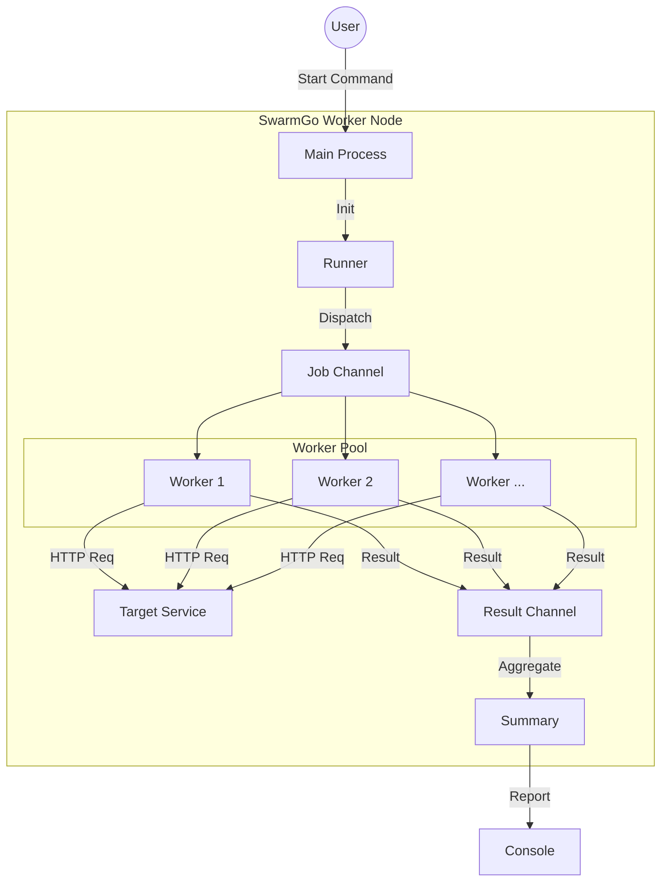

<div align="center">

# SwarmGo 🐝

[](https://go.dev/)
[](./LICENSE)
[](./README.md)

<br>

Goの並行処理能力を最大限に引き出す、HTTP負荷試験ツールです。<br>
Worker Poolアーキテクチャにより、数百万リクエスト規模でもメモリを枯渇させず、アクセスを安定して送り続けられます。

</div>
<br>


## 🚀 機能

- **📊 サーバーの「限界」と「弱点」を即座に特定**:
  ただ成功・失敗を表示するだけでなく、平均の速さやエラーの内訳（200 OK, 500 Errorなど）を表示します。「どこでサーバーが悲鳴を上げているか」がひと目でわかります。
- **⚡️ 手元のPCはサクサク、相手には強力な負荷**:
  独自の効率化（Worker Pool）により、自分のPCを重くすることなく、大量のアクセスを安定して送り込めます。「テスト中に自分のPCが固まる」といったストレスがありません。
- **🛠️ 1行のコマンドで、今すぐテスト開始**:
  面倒な設定や準備は一切不要です。「URL」「回数」「同時に送る数」を指定するだけで、思い立ったその瞬間に負荷テストを実行できます。
- **🛡 途中で止めてもデータは正確**: `Ctrl+C` での中断時も、進行中のリクエストを最後まで処理してから終了。テスト結果の信頼性を損ないません。


## 🛠 アーキテクチャ



## 💡 技術的なハイライト: メモリ枯渇問題の解決

最初頃の実装では、総リクエスト数の数だけゴルーチンを起動していたため、100万リクエストのような大規模なテストでは、大量のゴルーチンが待機状態となり、数GBのメモリを消費しクラッシュしてしまっていました。

そこで、**Worker Pool パターン**を導入し、同時実行数の分だけゴルーチンを起動して、それらがジョブキューからタスクを取得して処理する方式に変更しました。これにより、メモリ使用量を数MB〜数十MBに抑えつつ、高速な処理を可能にしています。

## 📦 インストール

Go 1.22+ が必要です。

```bash
git clone https://github.com/ryokotaka/SwarmGo.git
cd SwarmGo
go mod tidy
```

## 📖 使い方

ビルドして実行します。

```bash
# ビルド
go build -o swarmgo cmd/worker/main.go

# 実行例: 100回のリクエストを、https://example.com に10並列で実行
./swarmgo -url https://example.com -n 100 -c 10
```

### オプション

| フラグ | 説明 | 必須 | デフォルト |
|--------|------|:----:|------------|
| `-url` | テスト対象のURL (URL to be tested) | ✓ | - |
| `-n` | リクエスト総数 (Total Requests) | ✓ | 0 |
| `-c` | 同時実行数 (Concurrency) | ✓ | 0 |

## 📊 出力例

```
Summary:
  Total Requests: 10
  Success:        10
  Failed:         0
  Total Duration: 116.75ms
--------------------------------------------------
  RPS:            85.65 req/s
  Mean Latency:   23.26ms
--------------------------------------------------
Status codes:
  200: 10
```

## 🗺 今後のロードマップ

- [ ] リアルタイムの進捗バー表示 
- [ ] POSTメソッドやカスタムヘッダーのサポート
- [ ] RPS の計測と表示
- [ ] レイテンシ分布の計算

## 📜 ライセンス

MIT
