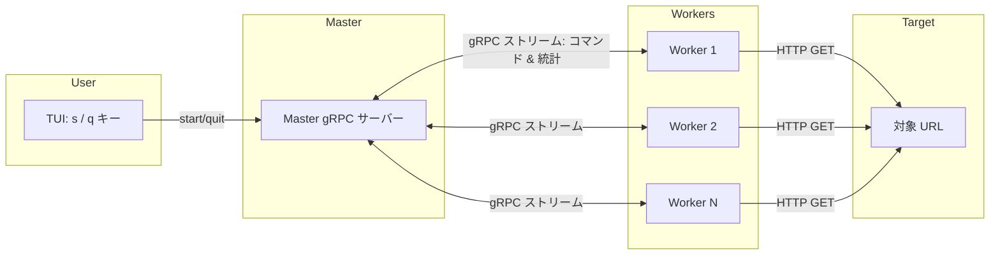

<div align="center">

# **SwarmGo**

[](https://go.dev/)
[](https://grpc.io/)
[](https://www.docker.com/)
[](./LICENSE)
[](./README.md)

<br>

**分散型の HTTP 負荷テストツール**です。1 台の **Master** が **gRPC** で複数の **Worker** に指示を出し、各 Worker は **Worker Pool** で並行数を抑えつつ HTTP リクエストを送ります。高負荷でもメモリが爆発しないようにしたかったのがきっかけです。

*分散システムや **goroutine**、**Docker** を「本で読むだけ」でなく実際に書いて理解したくて、ゼロから作ってみたプロジェクトです。*

<br>

---

### 📺 デモ

**Docker Compose** で一発起動 → Master の TUI にアタッチ → **`s`** で負荷テスト開始、**`q`** で終了、という流れが動画で分かります。


`docker compose up -d --build` から、接続 Worker 数・ライブ RPS・成功/失敗カウント・イベントログまで、実際の操作感が伝わるようにしています。

</div>

---

## 📖 このプロジェクトでやっていること

**SwarmGo** は、**Master** 1 台と **Worker** 複数台で「分散して」HTTP 負荷テストをするツールです。

- **Master**: **gRPC** サーバーと、オプションで TUI ダッシュボード。Start / Stop / Quit などのコマンドを Worker に送ります。
- **Worker**: Master に接続し、指定された URL に HTTP GET を打ち、RPS や成功/失敗数・完了イベントをストリームで返します。

Worker を増やせばその分スケールするので、1 プロセスで何百万もリクエストを抱え込む必要はありません。どこまで「分散」を意識して設計できるかを学ぶのが目的でした。

---

## 💡 なぜ作ったか

**Go** や **gRPC**、**Docker** は触ったことがあったものの、「分散」を意識した設計や、**goroutine** を安全に使いながらメモリを抑える方法を、自分で一通り実装して理解したかったです。

- **Go の並行処理**: たくさんの **goroutine** をどう協調させるか、**channel** でジョブキューをどう作るか。「1 リクエスト 1 goroutine」だとメモリが死ぬ話を、身をもって体験したくて **Worker Pool** を導入しました。
- **gRPC**: **Protobuf** でサービスを定義し、**双方向ストリーミング**で Master からコマンド、Worker から統計をリアルタイムで送る。接続・切断・再接続の扱いも含めて、ストリーミング RPC の感覚を掴みたかったです。
- **Docker**: Master と複数 Worker をコンテナで動かし、`docker-compose` で一発で立ち上がるようにしたかった。TUI をコンテナでどう扱うかも含めて、実運用に近い形で試したかったです。

「すごい負荷テストツール」を作ることが目的ではなく、**小さな分散システムをプロトコル設計から goroutine の安全性、デプロイまで通して作る**ことで理解を深めたくて始めました。

---

## 🏗 アーキテクチャ

構成はこんなイメージです。

1. **Master** は **gRPC** サーバー（と TUI）を動かし、接続してきた Worker のリストを保持します。各 Worker とは 1 本の **双方向 gRPC ストリーム**でつながっています。
2. **Worker** は Master に接続したあと、まず ID 付きの **Register** を送り、あとはループでコマンド（Start / Stop / Quit）を受け取り、実行中の **Stats** や完了時の **Finish** を送り返します。
3. TUI で **Start** を押すと、Master が接続中の全 Worker に Start を送ります。各 Worker は **固定サイズの Worker Pool** で対象 URL に HTTP GET を実行し、**Stats** を定期的に Master に送り、終わったら **Finish** を送ってダッシュボードを更新します。

HTTP のトラフィックは各 Worker から **対象 URL** に直接向かうだけで、Master はリクエストの中身を見ません。


```mermaid
flowchart LR
    subgraph User
        TUI[TUI: s / q キー]
    end
    subgraph Master
        M[Master gRPC サーバー]
    end
    subgraph Workers
        W1[Worker 1]
        W2[Worker 2]
        WN[Worker N]
    end
    subgraph Target
        URL[対象 URL]
    end
    TUI -->|start/quit| M
    M <-->|gRPC ストリーム: コマンド & 統計| W1
    M <-->|gRPC ストリーム| W2
    M <-->|gRPC ストリーム| WN
    W1 & W2 & WN -->|HTTP GET| URL
```

- **実線:** **gRPC**（Master ↔ Workers）と HTTP（Workers → 対象 URL）。
- **Master** は Worker ごとに 1 本のストリームを持ち、Start/Stop/Quit を全員に送ります。
- **Workers** は最初に **Register** を 1 回送り、以降は同じストリームで **Stats** と **Finish** を送ります。

---

## 🚀 動かし方（クイックスタート）

手軽に試すなら **Docker Compose** がおすすめです。**Go** を入れていなくても、1 コマンドで Master と複数 Worker が立ち上がります。

### Step 1: クローンしてディレクトリへ

```bash
git clone https://github.com/ryokotaka/SwarmGo.git
cd SwarmGo
```

### Step 2: Master と Worker をバックグラウンドで起動

```bash
docker compose up -d --build
```

- **Master**: TUI 付きで起動し、**gRPC** はポート `50051` で待ち受けます。
- **Workers**: デフォルトで 3 台起動し、**Docker** ネットワーク経由で `master:50051` に接続します。

Worker を 5 台にしたい場合などは、次のようにします。

```bash
docker compose up -d --build --scale worker=5
```

### Step 3: Master にアタッチして TUI を触る

Master はバックグラウンドで動いているので、TUI を操作するには次のコマンドでアタッチします。

```bash
docker attach $(docker compose ps -q master)
```

- **`s`** で負荷テスト開始（Worker が動いて統計を返してきます）。
- **`q`** で Master 終了（Worker に Quit を送ってから終了）。
- コンテナは動かしたままデタッチしたいときは `Ctrl+P` のあと `Ctrl+Q`。あとからまた `docker attach` できます。

### Step 4: 全部止める

```bash
docker compose down
```

### オプション: フォアグラウンドで起動する

ログを 1 つのターミナルにまとめて見て、Ctrl+C で止めたい場合は次のようにします。

```bash
docker compose up --build
```

このやり方だと TUI の対話はできないので、TUI を触りたいときは上記のアタッチ方法を使ってください。

---

## 📦 主な機能

| 機能 | 説明 |
|--------|-------------|
| **Master + Workers（gRPC）** | 1 台の Master が複数 Worker に指示を出し、Worker を増やしてスケールできます。 |
| **TUI ダッシュボード** | 接続 Worker 数・ライブ RPS・成功/失敗数・イベントログを表示。**`s`** でテスト開始、**`q`** で終了。 |
| **Worker Pool** | 各 Worker 内で固定サイズのプールを使い、並行数を抑えることでメモリを安定させています（大量 **goroutine** による OOM を避けるため）。 |
| **ヘッドレス Master** | `-no-tui` で **gRPC** だけの Master にでき、CI やスクリプト・リモートサーバーから叩く用途向けです。 |

---

## 🛠 Docker を使わずに動かす（ローカルで Go ビルド）

**Go 1.22+** が必要です。

```bash
go mod tidy
go build -o swarmgo ./cmd/swarmgo/
```

1. **ターミナル 1 — Master**  
   `./swarmgo master -p 50051`  
   （TUI なしで動かす場合は `-no-tui` を付けてください。）

2. **ターミナル 2 以降 — Worker**  
   `./swarmgo worker`  
   デフォルトでは `localhost:50051` に接続します。別ホストのときは `-addr host:port` や環境変数 `MASTER_ADDR` で指定できます。

3. Master の TUI で **`s`** でテスト開始、**`q`** で終了です。

---

## 🧠 設計で悩んだところと解決の方向性

作っていく中で、並行処理・**gRPC**・デプロイまわりでいくつか「こうすると危ない / こうするとうまくいく」を学んだので、要点だけまとめます。

### 1. Goroutine とメモリ（OOM）

**困ったこと:** 最初は「1 リクエスト 1 **goroutine**」で書いていました。小さい負荷なら問題ないのですが、100 万リクエストなどにすると、goroutine の数とスタックでメモリが一気に食われてクラッシュしました。

**やったこと:** **Worker Pool** に切り替えました。リクエスト数 N に対して N 個の goroutine を立てるのではなく、並行数ぶんだけ worker **goroutine** を固定で持ち、**バッファ付き channel** をジョブキューにします。1 つの goroutine がジョブを投入し、worker たちがチャネルから取り出して HTTP を実行。メモリは **O(並行数)** に抑えられ、総リクエスト数が増えても安定するようにしました。

### 2. gRPC の接続とストリーミング

**困ったこと:** Master がコマンドを送り、Worker が統計や完了イベントを返す必要があり、お互いにブロックしない形にしたかった。単純なリクエスト/レスポンスだと双方向のリアルタイム感が出ませんでした。

**やったこと:** 1 本の **双方向ストリーミング** RPC（`Connect`）にしました。Worker 1 台につき 1 本の長生きストリームで、Worker は `WorkerMsg`（register / stats / finish）を送り、`MasterCmd`（start / stop / quit）を受け取ります。接続のライフサイクルも「最初のメッセージは **Register**」「ストリームが閉いたらリストから削除」と決めておきました。

### 3. Worker リストの並行アクセス

**困ったこと:** Master は `map[workerID]stream` を持っていて、複数 **goroutine** から読まれたり（TUI、ブロードキャスト）書かれたり（Connect ハンドラ）します。何も考えないと race やパニックの原因になります。

**やったこと:** **mutex** で map を守りつつ、ブロードキャストのときは `stream.Send()` を**ロックを握ったまま**呼ばないようにしました。ロックを取って **スナップショット**（キーとストリームのコピー）だけ取り、ロックを外してからスナップショットに対して Send するようにして、デッドロックや長時間ロックを避けています。

### 4. 同じプロセスで TUI と gRPC を動かす

**困ったこと:** Master は **gRPC** サーバーと TUI の両方を動かすので、gRPC の処理でメインループがブロックすると UI が固まってしまいます。

**やったこと:** **gRPC** の各 `Connect` は別 **goroutine** で動かし、TUI はメイン goroutine で **channel** 経由で更新を受け取る形にしました。gRPC ハンドラは「worker 接続」「stats 更新」などのイベントをチャネルに **非ブロック**（`select` の `default`）で送り、TUI がそれを読んで再描画。UI が応答し続けるようにしています。

### 5. Docker で TUI と複数 Worker を一発で

**困ったこと:** **Go** を入れていない環境でも、1 コマンドで TUI 付き Master と複数 Worker を動かしたかったです。

**やったこと:** `docker-compose` で **master** サービス（対話用に `stdin_open` と `tty`）と **worker** サービス（`deploy.replicas: 3`）を定義しました。Worker は `MASTER_ADDR=master:50051` でサービス名で Master に届くようにしています。TUI を触るときは `docker compose up -d` のあと、master コンテナに `docker attach` して **`s`** / **`q`** を打つ流れにしました。

### 6. コンテナOSの選定とTLS証明書の壁

**困ったこと:** Worker コンテナを極小の **`alpine`** で動かした際、ルート証明書が欠落しており HTTPS 通信で **`x509`** エラーが発生しました。

**やったこと:** 一時的に `INSECURE_SKIP_VERIFY=1` で検証スキップして回避したあと、本番稼働を見据えて証明書周りが手堅い **`debian-slim`** ベースへ移行することで根本解決しました。インフラの選定が分散システムの動作に直結することを学びました。

---

## 🗺 ロードマップ

- [ ] TUI から対象 URL・リクエスト数・並行数を変更できるようにする
- [ ] TUI でリアルタイムに進捗が出るようにする
- [ ] POST など他の HTTP メソッドに対応する
- [ ] レイテンシの分布（P50, P99 など）を出せるようにする

---

## 📜 ライセンス

**MIT**
