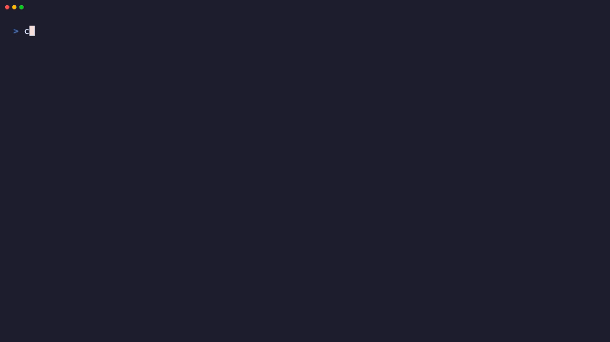
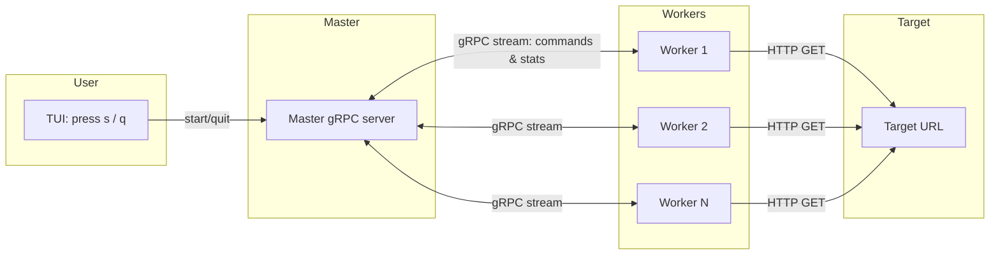

<div align="center">

# **SwarmGo**

[](https://go.dev/)
[](https://grpc.io/)
[](https://www.docker.com/)
[](./LICENSE)
[](./README.md)

<br>

**ターミナルから小さな負荷テストを動かして、リクエスト数・遅延・失敗をリアルタイムに見るための Go 製ツールです。**

SwarmGo は、操作用の画面、リクエストを送る複数の worker、ローカルのテスト用サーバーを Docker Compose でまとめて起動します。分散システムに詳しくなくてもまず動かせて、気になったら controller と worker の連携をコードで追えるサイズにしています。

<br>

---

</div>

## デモ

Docker Compose のデモでは、1 つの controller、リクエストを送る worker 3 つ、ローカルの `target-server` を起動します。外部 API を用意しなくても、その場で SwarmGo を試せます。

<div align="center">



</div>

ターミナル画面では、接続中の Workers、進捗、RPS、P50/P90/P99 レイテンシ、成功/失敗数、主なエラー理由を見られます。

---

## 何ができるか

負荷テストは、Web サイトや API に複数のリクエストを送り、どのくらい安定して応答できるかを見るためのものです。SwarmGo では、その流れを小さく、目で追える形にしています。

- **`s`** を押してテストを開始
- RPS（1 秒あたりのリクエスト数）、レイテンシ（応答にかかった時間）、成功/失敗数、エラーを確認
- ローカルのテスト用サーバーに対してすぐ試せる
- 後からコードを読んで、controller と worker がどう連携しているか追える

---

## クイックスタート

### Docker でローカルデモ

Docker と Docker Compose があれば、Go をインストールしなくても試せます。

```bash
git clone https://github.com/ryokotaka/SwarmGo.git
cd SwarmGo
docker compose up -d --build
docker attach $(docker compose ps -q master)
```

ターミナル画面が開いたら、**`s`** を押して組み込みの `target-server` に対して負荷テストを実行します。

### 起動後に見るもの

Workers が接続され、テストが始まると、ターミナル画面に次のような値が出ます。

- `Workers: 3` がデフォルト
- `Total RPS (realtime)` が `(no data yet)` から ASCII グラフと RPS 値に変わる
- `Success`, `Fail`, `Progress: current / total (%)`, レイテンシが更新される
- 正常なローカル target なら `Errors: None`、失敗があればエラー理由がまとまって出る

止めるときは:

- **`q`** で controller を終了
- controller を止めずに抜けたい場合は `Ctrl+P` のあと `Ctrl+Q`
- すべて片付ける場合:

```bash
docker compose down
```

> 注意: 負荷テストは、自分が所有している、または明確に許可を得ている対象にだけ実行してください。デフォルトのクイックスタートは、ローカルの `target-server` コンテナだけにリクエストを送ります。

---

## こんな人に向いています

- 自分のサーバーを用意せず、まず負荷テストを触ってみたい
- RPS、レイテンシ、失敗数が実行中にどう見えるのか確認したい
- 「1 つの controller が複数 worker に指示する」仕組みを小さいコードで見たい
- Go / gRPC / Docker Compose の実例を読みたい
- ヘッダー指定、レポート出力、ramp-up などを足すための土台がほしい

---

## ひと目でわかる現状

| 項目 | 現状 |
|------|------|
| **動くデモ** | Docker Compose で controller 1 つ、worker 3 つ、ローカル target を起動 |
| **負荷テストの範囲** | HTTP GET のみ。ターゲット URL、総リクエスト数、並行数は指定可能 |
| **ライブ表示** | ターミナル画面で Workers、RPS、進捗、レイテンシ、成功/失敗数、上位エラーを表示 |
| **向いている用途** | 負荷テストの基本を試しつつ、小さな Go/gRPC 分散システムとして読む |
| **向いていない用途** | k6、wrk、Vegeta などの本格的なベンチマークツールの代替 |

---

## SwarmGo の仕組み

SwarmGo は、シンプルな Master / Worker 構成で動きます。

- **Master:** gRPC サーバーとターミナル画面を持つ controller。Start / Stop / Quit を Workers に送る
- **Workers:** Master に接続し、指定された URL に HTTP GET を送り、統計を gRPC で返す
- **Target:** Workers から直接リクエストを受ける対象。Master は HTTP リクエストを中継しない

一番大きな目的は、巨大な負荷テストツールを作ることではありません。分散してリクエストを送る仕組みを、手元で動かして、読んで、拡張できるサイズにすることです。

---

## 主な機能

| 機能 | 説明 |
|------|------|
| **Master / Worker モデル** | 1 つの Master が複数 Workers を gRPC stream で制御 |
| **ローカルデモ** | Docker Compose で Master、Workers、テスト用 target をまとめて起動 |
| **ターミナル画面** | **`s`** で開始、**`q`** で終了。Workers、RPS、レイテンシ、成功/失敗数、エラーを確認 |
| **ターゲットと負荷の指定** | `-url`, `-n`, `-c` または環境変数でターゲット URL、総リクエスト数、並行数を指定 |
| **固定サイズの worker pool** | リクエストごとに goroutine を増やさず、並行数に応じて処理 |
| **レイテンシ百分位** | 成功リクエストの P50/P90/P99 を Workers が報告 |
| **上位エラー理由** | 通信エラーと HTTP 4xx/5xx を失敗として扱い、主な理由を集計 |
| **ヘッドレス Master** | `-no-tui` でターミナル画面なしの gRPC Master として起動 |

---

## Docker の設定

### Worker 数を増やす

デフォルトでは 3 つの Workers が起動します。増やす場合は次のようにします。

```bash
docker compose up -d --build --scale worker=5
```

### ターゲット、リクエスト数、並行数を変える

Docker Compose のデフォルトでは、組み込みの `target-server` に向けて実行します。

```env
TARGET_URL=http://target-server
TOTAL_REQUESTS=3000
CONCURRENCY=10
```

別の対象に向けたい場合は、プロジェクトルートに `.env` を置きます。

```bash
TARGET_URL=https://your-api.example.com
TOTAL_REQUESTS=100
CONCURRENCY=10
```

その後は通常どおり起動します。

```bash
docker compose up -d --build
```

1 回だけ上書きしたい場合は、次のように実行します。

```bash
TARGET_URL=https://your-api.example.com TOTAL_REQUESTS=100 CONCURRENCY=10 docker compose up -d --build
```

### フォアグラウンドで起動する

ログを 1 つのターミナルにまとめて見たい場合:

```bash
docker compose up --build
```

対話的に **`s`** / **`q`** を押して使う場合は、バックグラウンド起動後に `docker attach` する方法が扱いやすいです。

---

## Docker なしで動かす

**Go 1.22+** が必要です。

```bash
go mod tidy
go build -o swarmgo ./cmd/swarmgo/
```

ターミナル 1: Master を起動します。

```bash
./swarmgo master -p 50051
```

ターゲットや負荷を指定する場合:

```bash
./swarmgo master -p 50051 -url https://example.com -n 100 -c 10
```

ターミナル 2 以降: Workers を起動します。

```bash
./swarmgo worker
```

Workers はデフォルトで `localhost:50051` に接続します。別ホストの Master に接続する場合は `-addr host:port` または `MASTER_ADDR` を使います。

---

## アーキテクチャ

1. **Master** が gRPC サーバーを起動し、接続中の Workers を管理します。
2. 各 **Worker** は Master に対して、長く生きる双方向 gRPC stream を 1 本開きます。
3. Master はその stream でコマンドを送り、Workers は register / stats / finish を同じ stream で返します。
4. テスト中の HTTP GET は Workers から target URL へ直接送られ、Master は進捗だけを受け取ります。


```mermaid
flowchart LR
    subgraph User
        TUI[TUI: press s / q]
    end
    subgraph Master
        M[Master gRPC server]
    end
    subgraph Workers
        W1[Worker 1]
        W2[Worker 2]
        WN[Worker N]
    end
    subgraph Target
        URL[Target URL]
    end
    TUI -->|start/quit| M
    M <-->|gRPC stream: commands & stats| W1
    M <-->|gRPC stream| W2
    M <-->|gRPC stream| WN
    W1 & W2 & WN -->|HTTP GET| URL
```

---

## 設計メモ

SwarmGo は、分散システム、Go の並行処理、gRPC streaming、Docker Compose による複数サービス構成を、自分で実装して理解するために作りました。

### リクエストごとに goroutine を作らない

最初は 1 リクエストごとに goroutine を作る形でも動きます。ただし、リクエスト数が大きくなると goroutine とメモリ使用量が増えすぎます。そこで、各 Worker は固定サイズの worker pool を使い、メモリ使用量が総リクエスト数ではなく並行数に近い形で増えるようにしています。

### 双方向 gRPC stream

Worker ごとに 1 本の bidirectional stream を開きます。Master は Start / Stop / Quit を送り、Worker は register / stats / finish を返します。ポーリングや別プロトコルを増やさず、同じ接続でコマンドと統計を流せるようにしました。

### Worker 一覧の安全な管理

Master は接続中の Workers を map で持ちます。複数 goroutine から読まれるため mutex で守り、broadcast では map のスナップショットだけ取ってから lock を外し、その後に `stream.Send()` しています。ネットワーク送信中に lock を持ち続けないためです。

### gRPC とターミナル画面を同じプロセスで動かす

Master は gRPC サーバーとターミナル画面を同時に動かします。gRPC 側のイベントは channel で UI に渡し、ターミナル画面はそれを読んで再描画します。Worker の接続や stats 更新があっても、画面操作が止まらないようにしています。

### HTTP 4xx/5xx も失敗として扱う

Go の HTTP client は、4xx/5xx のレスポンスだけでは error を返しません。SwarmGo ではステータスコード 400 以上も失敗として扱い、通信エラーとあわせて上位エラー理由に集計します。

---

## 制限

- HTTP リクエストは現在 **GET のみ**です。
- カスタムヘッダー、リクエストボディ、POST/PUT などのシナリオは未対応です。
- 結果はターミナル画面とログで確認します。JSON/CSV などのレポート出力はまだありません。
- ramp-up や duration 指定の実行は未対応です。
- SwarmGo は小さく読める分散負荷テストプロジェクトであり、本格的なベンチマークツールの代替ではありません。

---

## 今後やりたいこと

- カスタムヘッダー指定
- POST / request body 対応
- JSON または CSV でのレポート出力
- ramp-up や時間指定の実行
- 実行後の worker 別サマリー

---

## ライセンス

**MIT**
