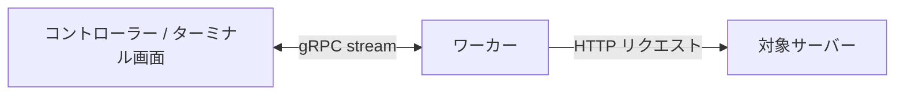

# SwarmGo

[English](./README.md) · [MIT ライセンス](./LICENSE)

Go で作った分散型の HTTP 負荷テストツールです。複数のワーカーからリクエストを送り、ターミナルで結果を見るか、自動実行して JSON に保存できます。GET・POST に加え、送信する本文とヘッダーも指定できます。

Docker Compose でコントローラー、ワーカー 3 台、テスト対象のサーバーが起動します。**s** を押すと合計 9,000 件のリクエストを送信します。ワーカー数を増やして負荷を変えたり、対象サーバーにエラーを返させて失敗時の動きを見たりできます。


## まず動かす

Docker と Docker Compose を用意して、次を実行します。

```bash
git clone https://github.com/ryokotaka/SwarmGo.git
cd SwarmGo
docker compose up -d --build
docker attach "$(docker compose ps -q master)"
```

`Workers: 3` になったら **s** を押します。各ワーカーが、同梱の `target-server` に 3,000 回の GET リクエストを送ります。並行数は各ワーカーで最大 10、全体では **合計 9,000 リクエスト、最大 30 並行**です。

完了後も結果は画面に残ります。もう一度実行する場合は **s**、実行中のリクエストを中止してコントローラーを終了する場合は **q** を押します。終了せずに画面から離れる場合は **Ctrl+P**、続けて **Ctrl+Q** です。

使い終わったらコンテナを片付けます。

```bash
docker compose down
```

負荷テストは、自分が所有しているか、許可を得ている対象にだけ実行してください。この手順ではローカルの Compose ネットワーク内にだけリクエストを送ります。

## 負荷を変える

リクエスト数と並行数は、どちらも **ワーカー 1 台あたり**の値です。次の例では 5 台のワーカーが各 1,000 回、合計 5,000 回のリクエストを送ります。

```bash
TOTAL_REQUESTS=1000 CONCURRENCY=5 docker compose up -d --build --scale worker=5
docker attach "$(docker compose ps -q master)"
```

| 設定 | Compose の初期値 | 意味 |
| --- | --- | --- |
| `TARGET_URL` | `http://target-server` | 各ワーカーがリクエストを送る URL |
| `TOTAL_REQUESTS` | `3000` | 1 回の実行で各ワーカーが送るリクエスト数 |
| `CONCURRENCY` | `10` | 各ワーカーで同時に処理するリクエスト数の上限 |
| `--scale worker=N` | `3` | ワーカーのコンテナ数 |

失敗時の表示を見るには、同梱の echo server にエラーを返させます。

```bash
TARGET_URL='http://target-server/?echo_code=500' TOTAL_REQUESTS=100 docker compose up -d --build
docker attach "$(docker compose ps -q master)"
```

**s** を押して完了を待つと、失敗したリクエストが `HTTP 500 Internal Server Error` として集計されます。

## ソースから動かす

[go.mod](./go.mod) に合わせて **Go 1.25.7 以降**を使います。

```bash
go build -o swarmgo ./cmd/swarmgo
```

テスト対象には、手元で起動した HTTP サーバーを使います。Python 3 があれば、1 つ目のターミナルで空の一時ディレクトリを配信できます。

```bash
python3 -m http.server 8080 --bind 127.0.0.1 --directory "$(mktemp -d)"
```

2 つ目のターミナルでコントローラーを起動します。

```bash
./swarmgo master -url http://127.0.0.1:8080 -n 100 -c 5
```

3 つ目のターミナルでワーカーを起動します。

```bash
./swarmgo worker
```

コントローラーの画面で **s** を押すと開始します。ワーカーを増やす場合は、実行前に別のターミナルでも起動してください。

ソースから起動した場合の初期値は、対象が `http://127.0.0.1:8080`、リクエスト数が 5、並行数が 1 です。Compose と同じ環境変数を使うか、`-url`、`-n`、`-c` で指定できます。ワーカーの接続先は初期値が `localhost:50051` で、`-addr host:port` または `MASTER_ADDR` で変更します。コントローラーのポートは `-p` で指定します。

`master -no-tui` は gRPC の待ち受けだけを起動します。負荷テストの自動開始や、コマンドラインから開始する機能はありません。

## 1 回実行して結果を保存する

ローカルのテスト対象を起動してから、2 台のワーカーを待つコントローラーを起動します。

```bash
./swarmgo run -url http://127.0.0.1:8080 -workers 2 -n 100 -c 5 -output report.json
```

別のターミナルを 2 つ開き、それぞれで `./swarmgo worker` を実行します。2 台が接続すると自動で開始し、合計 200 リクエストを送って `report.json` に保存したあと、ワーカーを終了します。キー入力は不要です。

接続を待つ時間は `-worker-timeout`（初期値 `30s`）、実行時間の上限は `-timeout`（初期値 `2m`）で指定します。予定したリクエストがすべて成功した場合だけ終了コード 0 を返します。リクエストの失敗、切断、タイムアウト、出力エラーは 1、引数の誤りは 2 です。

JSON には完了状態、リクエスト数、経過時間、コントローラー全体の RPS、ワーカー別のレイテンシ百分位とエラーを保存します。コントローラーの RPS は、指示の送信開始から最終報告までを計測区間に使います。百分位はワーカー別の値です。次のリクエスト指定は `master` と `run` の両方で使えます。

## JSON を送る

ローカルの API が `/api` で JSON を受け付ける場合は、本文をファイルに保存して POST を指定します。

```bash
printf '%s\n' '{"message":"hello"}' > request.json
./swarmgo master -url http://127.0.0.1:8080/api -method POST \
  -body-file request.json -header 'Content-Type: application/json' -n 100 -c 5
```

上と同じようにワーカーを起動し、**s** を押します。対象には POST を処理できる API を使ってください。GET の例で使った Python のファイルサーバーは POST に対応していません。

`-body-file` は起動時に一度だけ読み込みます（上限 1 MiB）。各リクエストには同じバイト列を送り、Content-Length は自動で設定します。`Content-Type` は本文に合わせて指定してください。ヘッダーを増やす場合は `-header 'Name: value'` を繰り返します。同じ名前では大文字・小文字を区別せず、最後の指定を使います。

コントローラーとワーカーには同じビルドを使ってください。旧ワーカーは追加されたメソッド・本文・ヘッダーの指定を無視し、GET を送ります。更新後のワーカーは旧コントローラーの GET 指示も受け付けます。

JSON API につなぐ例として、[Thermal Guardian とのデモ](https://github.com/ryokotaka/swarmgo-thermal-demo)も用意しています。1 コマンドで 3 台のワーカーから温度に応じて処理先を変えるチャット API へリクエストを送り、保存した結果まで確認できます。

## 仕組み

Go の並行処理と gRPC ストリーミングを理解するために作りました。複数のワーカーへの指示と結果の集約が、実際に動かしながら見える構成にしています。


```mermaid
flowchart LR
    C[コントローラー / ターミナル画面] <-->|gRPC stream| W[ワーカー]
    W -->|HTTP リクエスト| T[対象サーバー]
```

コントローラーは、開始時点で接続しているワーカーに指示を送ります。各ワーカーは固定数の goroutine で対象サーバーに直接リクエストを送り、同じ gRPC ストリームで進捗を返します。途中から接続したワーカーは次の実行から参加します。

ワーカーは負荷テスト中も指示を受け付けます。Quit、Stop、コントローラーとの切断で、処理中の HTTP リクエストをキャンセルします。実行中にもう一度 **s** を押しても、重複して開始しません。

コードを読む場合は、次のファイルから追えます。

- [runner.go](./internal/worker/runner.go)：HTTP リクエスト、並行処理、レイテンシの記録。
- [client.go](./internal/worker/client.go)：ワーカーの指示受信と、順序を保った進捗報告。
- [server.go](./internal/master/server.go)：接続中のワーカーと実行状態の管理。
- [tui.go](./cmd/swarmgo/tui.go)：画面表示とキー入力。
- [run.go](./cmd/swarmgo/run.go)：自動実行と JSON レポート。
- [swarm.proto](./proto/swarm.proto)：コントローラーとワーカーがやり取りするメッセージ。

## 指標の定義

<details>
<summary>リクエスト数・RPS・レイテンシ・エラーの数え方</summary>

- **成功・失敗：** レスポンス本文を最後まで読めて、最終的な HTTP ステータスが 400 未満なら成功です。4xx/5xx、通信エラー、タイムアウト、処理中にキャンセルしたリクエストは失敗として数えます。リダイレクトは Go 標準の HTTP クライアントに従います。
- **RPS：** 各ワーカーの「完了リクエスト数 ÷ 開始からの経過時間」を画面上で合計します。実行開始からの平均値であり、瞬間的な処理量や、全ワーカーの時刻を厳密にそろえた値ではありません。完了後も最後の値が残ります。
- **レイテンシ：** 成功したリクエストについて、本文を受信し終わるまでの時間を測ります。各ワーカーが終了時に nearest-rank 法で P50/P90/P99 を計算し、画面には P99 が最も大きいワーカーの 3 つの値を表示します。**全ワーカーのリクエストをまとめて計算した百分位ではありません。** 通信時に整数のミリ秒に変換するため、1 ms 未満の値は `-` と表示される場合があります。
- **エラー理由：** 各ワーカーの最終報告で反映します。ワーカーが切断した場合は途中までの結果になることがあり、残りの処理は他のワーカーに割り当て直しません。

リクエストの待ち行列は並行数に応じた大きさです。一方、成功したリクエストのレイテンシは終了まで保存するため、その分のメモリ使用量は成功件数に応じて増えます。

</details>

## 現在の範囲

HTTP メソッドの指定、固定のリクエスト本文とヘッダー、固定リクエスト数、固定並行数に対応しています。送信レートのスケジュール、ワーカーの再接続、制御用 gRPC 接続の TLS・認証は未対応です。コントローラーとワーカーは信頼できるネットワーク内で使ってください。Compose のコントローラーポートは localhost にだけ公開しています。ソースから起動したコントローラーは全インターフェースで待ち受けます。

## 開発時の確認

```bash
go test -race ./...
go vet ./...
go build ./...
```

テストにはローカルの HTTP / gRPC サーバーを使います。GET/POST の並行実行、本文の再送、キャンセル、報告順序、経過時間の計算、画面への通知が落ちた場合の状態復元を確認しています。同じチェックを GitHub Actions でも実行します。

生成済みのプロトコルファイルを含めているため、ビルドに `protoc` は不要です。スキーマを変えた場合は、protoc 33.4、protoc-gen-go v1.36.11、protoc-gen-go-grpc v1.6.1 で再生成します。

```bash
protoc --go_out=. --go_opt=paths=source_relative \
  --go-grpc_out=. --go-grpc_opt=paths=source_relative proto/swarm.proto
```
