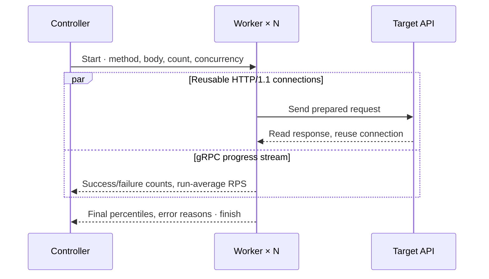

<div align="center">

# SwarmGo

**分散HTTP負荷試験を、ひとつのターミナルから。**

[](go.mod)
[](https://github.com/ryokotaka/SwarmGo/actions/workflows/go.yml)
[](LICENSE)

[まず動かす](#まず動かす) · [APIを試験する](#apiを試験する) · [性能の記録](#性能の記録) · [English](README.md)

</div>

Go製の分散HTTP負荷試験ツールです。POST本文やヘッダーを指定し、処理量・レイテンシ・エラーを確認できます。自動実行とJSONレポートにも対応しています。

**1分間のローカル比較で平均51.8万POST/秒。k6の4.3倍を記録しました。**

[](benchmarks/throughput/)

## まず動かす

DockerとDocker Composeを用意して実行します。

```sh
git clone https://github.com/ryokotaka/SwarmGo.git
cd SwarmGo
docker compose up -d --build
docker attach "$(docker compose ps -q master)"
```

`Workers: 3`になったら **s** を押します。3台のワーカーが同梱のローカルサーバーに**合計9,000件**を送ります。完了後も、処理量・進捗・エラーを画面で確認できます。

もう一度実行する場合は **s**、停止は **q**。使い終わったら `docker compose down` で片付けます。


<sub>実行画面：ローカルAPIへ400万件のPOSTを送信。256接続、要求・応答とも1 KiB、送信レート制限なし。<a href="assets/demo.json">実行記録</a>。</sub>

## APIを試験する

Go 1.25.7以降でビルドします：`go build -o swarmgo ./cmd/swarmgo`。

手元のAPIが`/api`でJSONを受け付ける場合は、本文を用意して起動します。

```sh
printf '%s\n' '{"message":"hello"}' > request.json
./swarmgo run -url http://127.0.0.1:8080/api \
  -method POST -body-file request.json -header 'Content-Type: application/json' \
  -workers 1 -n 10000 -c 100 -output report.json
```

別のターミナルで `./swarmgo worker` を起動すると試験が始まります。完了件数・エラー・レイテンシ百分位を`report.json`に保存し、予定したリクエストがすべて成功すると終了コード`0`を返します。

別のPCでもワーカーを起動すれば、複数の機材から負荷を送れます。リクエスト数と並行数は**ワーカー1台あたり**の設定です。

[ワーカーの追加・ヘッダー・タイムアウト・レポートの読み方 →](GUIDE_ja.md)

## アクセスが急増しても応答できるか

`swarmgo resilience`は、通常アクセスを続けながら一定時間だけ負荷を増やします。通常リクエストの応答時間・失敗率・回復までの時間を測ります。

同梱のAPIでは、受け入れ制限を加えると、負荷中の通常アクセスの応答時間が**3.51秒から92ミリ秒**に改善しました。次のコマンドで、対策前後を手元で比較できます。

```sh
python3 examples/resilience/demo.py
```

Go・Python 3・Dockerが必要です。[実測結果とコマンド →](examples/resilience/)

## 性能の記録

冒頭の比較は、送信レートに上限を設けず、対象サーバーが受け取った有効なPOSTを数えたものです。各ツールの設定、実行コマンド、JSONの生データを公開しています。

| 試験 | SwarmGoの結果 | 記録 |
| :--- | :--- | :--- |
| 送信レート制限なし・60秒 | **平均51.8万POST/秒** | [4ツールの比較](benchmarks/throughput/) |
| 毎秒20万件指定・5分間 | **5,971万件が正常完了**・最大89.7 MiB | [継続試験](benchmarks/arrival/recorded-endurance/) |

<details>
<summary>60秒間のRPS推移を見る</summary>


</details>

## 仕組み


```mermaid
sequenceDiagram
    participant C as Controller
    participant W as Worker × N
    participant A as Target API
    C->>W: Start · method, body, count, concurrency
    par Reusable HTTP/1.1 connections
        W->>A: Send prepared request
        A-->>W: Read response, reuse connection
    and gRPC progress stream
        W-->>C: Success/failure counts, run-average RPS
    end
    W-->>C: Final percentiles, error reasons · finish
```

コントローラーは開始・停止と結果の集約を担当し、HTTP通信はワーカーからAPIへ直接送ります。負荷を生成する経路では、次の3点を重視しています。

- **送信のたびに作り直さない。** 並行数に応じた数のgoroutineを動かし、HTTP/1.1の送信データと各goroutineの接続を再利用します。リクエストごとにgoroutineを起動したり、送信データを組み立てたりする処理を省きます。[送受信の実装](internal/worker/direct.go)
- **レイテンシの記録を件数に比例させない。** 結果を小さな単位でまとめて集計し、成功リクエストのレイテンシは全件保存せずHDRヒストグラムに記録します。長い試験でも、レイテンシ記録用のメモリは増え続けません。[並行実行と集計](internal/worker/aggregate.go)
- **HTTPの処理を省略して速度を稼がない。** 応答本文を読み切り、タイムアウト・キャンセル・TLS証明書の検証も行います。リダイレクトなどはGoの標準クライアントに任せています。[HTTP処理のテスト](internal/worker/direct_test.go)

実行中は成功・失敗件数と開始からの平均RPSを報告し、終了時にレイテンシ百分位とエラー理由を確定します。[レポートの指標](GUIDE_ja.md#指標の定義)

```sh
go test -race ./...
go vet ./...
go build ./...
```

<details>
<summary>測定条件と指標の詳細</summary>

**処理量の比較：** Apple M4のローカルARM64 Docker、HTTP/1.1、要求・応答とも1 KiB。生成側は各6 GiB、CPU制限なし。64・256・1,024接続を短時間ずつ試し、各ツールで最も速かった設定を採用。5秒の準備運転後、60秒を各1回観測しました。生成側と対象は同じマシンを共有し、対象側で本文を検証したPOST件数からRPSを計算しています。wrkは575,360/s、SwarmGoは517,832/s、ohaは414,956/s、k6は119,480/s。この負荷条件での実測値です。SwarmGoを観測後に締切停止した際の部分レポートと、wrkのtimeoutカウンターも[全記録](benchmarks/throughput/)に残しています。

**5分間の試験：** 対象サーバーが異なる、毎秒20万件指定の各1回の試験です。SwarmGoのHTTP失敗はゼロ、未送信は0.48%。元の厳密な判定は`inconclusive`のまま保存しています。ohaは同じ6 GiBのメモリ上限に達し、約169秒で停止しました。[条件と生データ](benchmarks/arrival/recorded-endurance/)。

**高負荷時の比較：** 3.51秒と92ミリ秒は、通常アクセスにおける1秒ごとのp99の最大値です。両方とも予定した負荷を送り切っています。同梱APIに施した対策の効果をSwarmGoで測定した結果です。

**利用範囲：** 自分が所有するか、許可を得た対象に使ってください。制御用接続にTLS・認証はないため、コントローラーとワーカーは信頼できるネットワーク内で使います。ソースから起動したコントローラーは全インターフェースで待ち受け、Composeはそのポートをlocalhostに公開します。[指標の定義と対応範囲](GUIDE_ja.md#指標の定義)。

</details>

[MITライセンス](LICENSE) · [使い方ガイド](GUIDE_ja.md)
