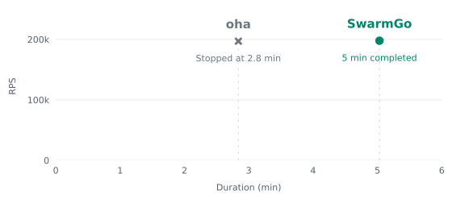

# Five minutes at 200,000 requested POSTs/s

**SwarmGo completed 59.7 million successful POSTs over the five-minute load phase, using 89.7 MiB of peak generator memory.** In the same workload and memory budget, oha v1.16.0 stopped after 169 seconds when the kernel killed its load process for exceeding 6 GiB.

This is one recorded trial per tool, measured on 2026-09-23. It demonstrates a difference in completing this large workload; it does not establish a maximum RPS or superiority over every HTTP generator.

## Results

| Metric | SwarmGo | oha v1.16.0 |
| --- | ---: | ---: |
| Requested POST rate | 200,000/s | 200,000/s |
| Requested load duration | 300 s | 300 s |
| Outcome | Reached the scheduled end | OOM killed after 169.24 s |
| Valid POST bodies received by target | 59,713,630 | 33,556,480 |
| Successful POSTs confirmed by client | 59,713,630 | No client report in quiet mode |
| Client HTTP failures | 0 | Unavailable |
| Planned starts missed | 286,370 / 60,000,000 (0.477%) | Unavailable |
| Peak generator cgroup memory | 89.66 MiB | 6,144 MiB |
| Kernel OOM kills | 0 | 1 |

SwarmGo averaged **199,045 completed POSTs per requested load second**. Its native resilience verdict remains `inconclusive` because the scheduled rate was not delivered in full. This comparison reports that shortfall instead of treating the run as either a perfect schedule or a useless result. All started POSTs succeeded; target counts and full request-body bytes match its report. Its separate 10/s ordinary stream also completed all 3,020 requests without failures or missed starts.

oha used `--no-tui --output-format quiet --latency-correction -w`. Its quiet mode produces no client result report, so the target's accepted request count is not presented as a client-confirmed success count. Exit 137 and `memory.events: oom_kill=1` identify the stop. There was no harness timeout. The target reported zero invalid requests and no active requests in the final snapshot.

## Reading the RPS × duration plot

The horizontal axis is the target's observed interval, from its first to its last request. The vertical axis is validated POST count divided by that interval. Both tools use this same target-side definition, including the ordinary GET probe before and after the POST phase. The plot excludes GETs from the numerator.

| Plot coordinate | SwarmGo | oha v1.16.0 |
| --- | ---: | ---: |
| Target observation | 301.896616 s | 170.302696 s |
| Target POSTs / observation second | 197,794.963 | 197,040.216 |

The observed rates are similar; this run's clear difference is duration. The circle marks completion of the scheduled five-minute load, not SwarmGo's maximum endurance. The cross marks oha's memory-limit stop. Target-observed duration includes the probe, so it differs from the POST schedule and generator process duration. Likewise, SwarmGo's 199,045/s over its 300-second POST schedule differs from its plotted whole-observation rate.

These are average-rate endpoints. The [recorded animation](../../../assets/endurance.gif) shows rate over time from approximately five-second counter differences; its final interval includes shutdown. The [count and memory curves](../../../assets/endurance.svg) show how the run progressed. The comparison has one trial per tool and does not establish a maximum sustainable RPS frontier.

## Why this matters

A load test cannot establish whether an API can handle five minutes of heavy traffic if the generator stops halfway through. SwarmGo stores compact time-window counts and latency histograms instead of keeping every request result. The useful difference here is finishing a roughly 60-million-request test on this machine, while still keeping a report of response failures, latency and missed starts.

oha v1.16.0 retains completed request results; `quiet` skips final display but does not remove that retention. [Result storage](https://github.com/hatoo/oha/blob/v1.16.0/src/result_data.rs#L12-L76), [rate-limited execution](https://github.com/hatoo/oha/blob/v1.16.0/src/lib.rs#L703-L858), [quiet output](https://github.com/hatoo/oha/blob/v1.16.0/src/printer.rs#L108-L133).

This limitation is version- and workload-specific. More RAM, a different implementation or future oha changes may change the outcome. wrk2 and Vegeta are other relevant tools; this is not a comparison against them. The [earlier k6 comparison](../../capacity/) measures a different, high-concurrency workload.

## Conditions

- Apple M4; local ARM64 Docker VM, 10 CPUs and 7.65 GiB RAM. Client and target share that VM.
- Same generator limit: **6 GiB**, including the ordinary-request generator; target: **512 MiB**. No additional swap and no CPU quotas or pinning. These limits leave room for Docker within the existing VM.
- HTTP/1.1 keep-alive, 1 KiB JSON POST and 1 KiB response. The local Go target adds no response delay and validates the full method, protocol and request body. Both clients consume responses.
- Concurrency ceiling 2,048. A separate 10 GETs/s stream with ceiling 32 begins about one second before the POST phase and ends about one second afterward. GET responses are 128 B. oha uses a second process in the same generator container for that stream.
- Five-second request timeout. Started responses may finish after the schedule ends. SwarmGo allows at most 50 ms of start delay and records missed slots; oha uses its own QPS limiter and corrected latency mode. Their scheduling and latency semantics differ, so no cross-tool latency claim is made.
- No discarded warmup. SwarmGo ran first, oha second, in fresh containers. No repetitions or order reversal; no claim of an exact general performance ratio.
- Only an internal Docker network, no published ports, no external load target or cloud account. Containers and network were removed afterward.

## Inspect and reproduce

[SwarmGo raw data](swarmgo/results.json) · [SwarmGo native report](swarmgo/native.json) · [oha raw data](oha/results.json) · [Reproduction](../ENDURANCE.md)

Raw data includes source/binary hashes, official oha download and digest, commands, Docker resources, five-second samples, target counters and cgroup memory events. SwarmGo's measured source is `607ff795fd8f05436e5875656a5e8c3b406c6bdc` with Go 1.25.7. oha is the official v1.16.0 Linux ARM64 binary.

[bench-executed.py](bench-executed.py) records the original pilot harness; it expects that pilot directory layout. The packaged `endurance.py` uses the preparation files in this repository and adds portable output paths, build checks and stricter interruption cleanup. [plot_endurance_xy.py](../plot_endurance_xy.py) generates the RPS/duration figure; [plot_endurance.py](../plot_endurance.py) generates the count/memory curves. Both read these records. Install matplotlib and run either script from any working directory; `--png PATH` also writes a PNG.
